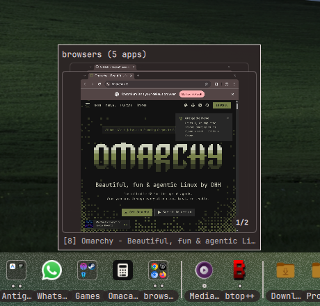
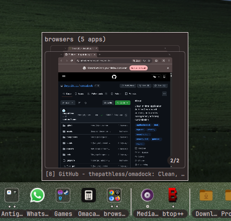
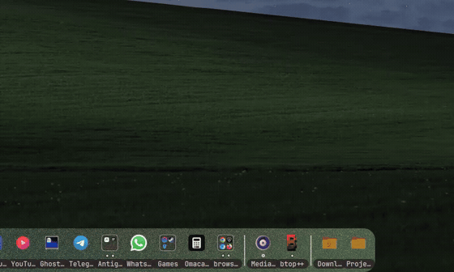
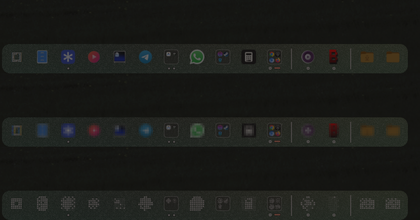
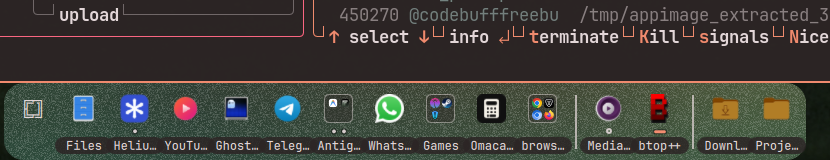
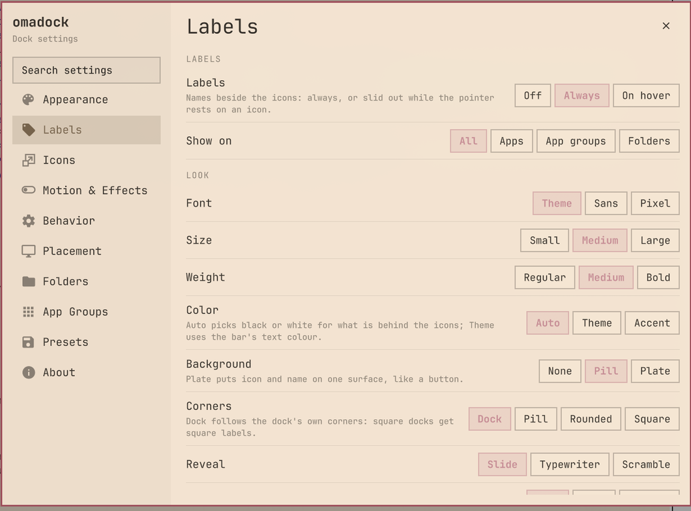
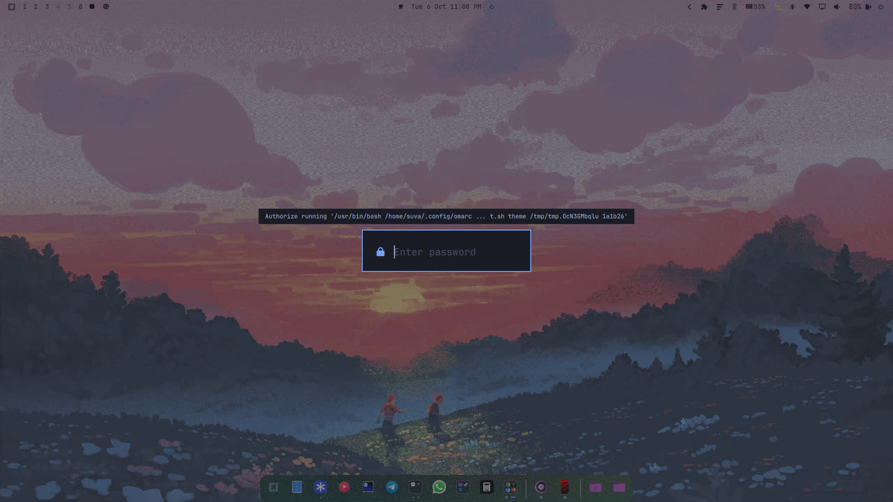
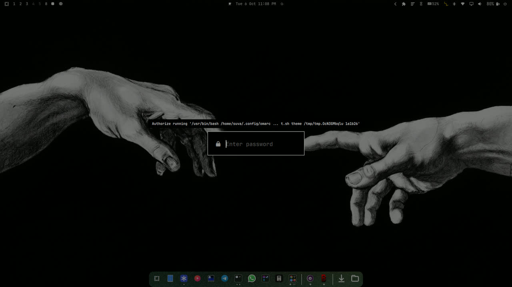
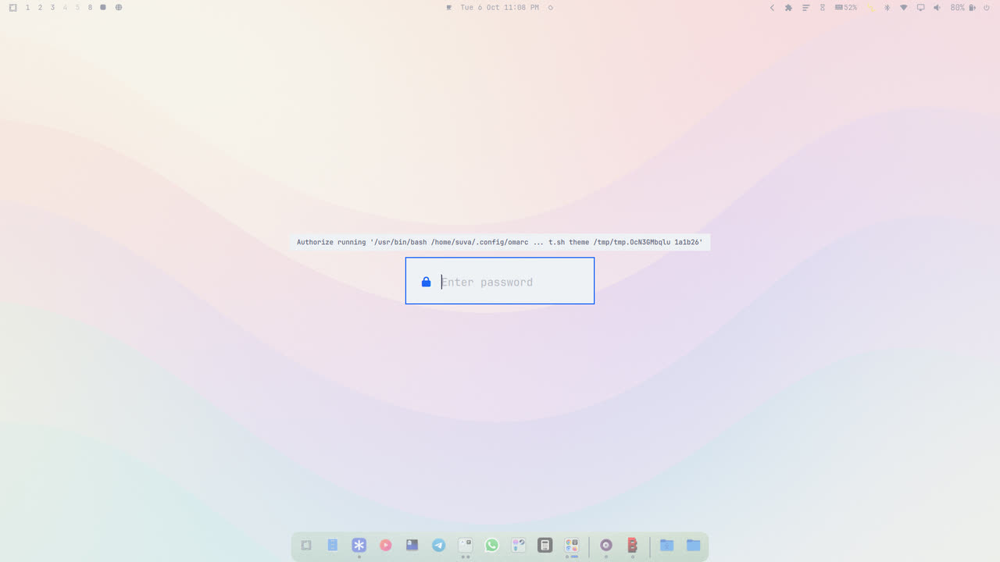

<div align="center">

# ❖ omadock ・ オマドック

### *A modern, fluid, zero-CPU application dock engineered for Omarchy Linux*

[](https://github.com/thepathless/omadock/releases)
[](https://github.com/thepathless/omadock/actions/workflows/ci.yml)
[](https://omarchy.org)
[](https://hyprland.org)
[](https://quickshell.org)
[](LICENSE)

<br />

<p align="center">
  
</p>

<p align="center">
  <a href="#-quick-start"><b>Quick Start</b></a> •
  <a href="#-core-features"><b>Features</b></a> •
  <a href="#-minimized-preview-tiles"><b>Preview Tiles</b></a> •
  <a href="#-customization--theming"><b>Theming</b></a> •
  <a href="#%EF%B8%8F-controls-cheat-sheet"><b>Controls</b></a> •
  <a href="#%EF%B8%8F-configuration-reference"><b>Configuration</b></a> •
  <a href="#-keyboard-shortcuts-via-ipc"><b>Keybindings</b></a> •
  <a href="#-faq"><b>FAQ</b></a> •
  <a href="#support-the-project"><b>Support</b></a>
</p>

</div>

---

## ❤️ Support the project

omadock is built by **[thepathless](https://github.com/thepathless)**, a medical student in India who codes between classes and clinics. It's free, and it always will be — but building it costs money I don't quite have: monthly AI coding tokens, and a laptop that's falling apart (dead WiFi, sticky keys, a trackpad with a mind of its own) — so I'm saving for a **[Dell XPS 13 (2026)](https://www.dell.com/en-us/blog/year-of-the-linux-laptop-omarchy-on-xps/)**.

If omadock earns a place on your desktop, [**sponsoring me**](https://github.com/sponsors/thepathless) keeps the AI lights on and the laptop fund growing. Every supporter is honored on the [**supporters wall**](SPONSORS.md) 💝 — with love, no tiers, no perks.

<p align="center">
  <a href="https://github.com/sponsors/thepathless"></a>
</p>

### 💻 Laptop fund


### 📊 Where donations went

| Month | AI tokens | Laptop fund | Notes |
| :--- | :--- | :--- | :--- |
| — | — | — | Just launched — be the first! 🙏 |

*(running total so far: **−₹499** for my coding-agent subscription — borrowed from my mom 😅. Updated monthly; honesty is the least I can offer)*

**Freebuff wallet (2026-10-03):** omadock creator [thepathless](https://github.com/thepathless) reports adding **₹1,000 to their Freebuff wallet** to fund continued development.

To everyone who donates — really, truly, thank you. 🙏

---

## ⚡ Overview

**omadock (オマドック)** is a fluid, zero-CPU application dock for **[Omarchy](https://omarchy.org/)** — Arch, Hyprland, Quickshell.

Crafted in the spirit of **Omakase (おまかせ)**: wave magnification, live window previews, app groups, multi-monitor docks. Beautiful, opinionated, and strictly **0.00% background CPU**.

<p align="center">
  
</p>

### ✨ Key Highlights

- **🌊 Wave magnification** — cosine-falloff dock physics, or classic zoom. Zero coordinate jumping.
- **🪟 Live window previews** — minimized windows park on the dock as thumbnail cards.
- **🔘 3-state window dots** — active, visible, and minimized at a glance.
- **📁 Folders & groups** — folder stacks with recent files, smart app collections, drag-to-group.
- **🖥️ Multi-monitor** — one dock per monitor, each showing its own monitor's windows.
- **💾 Removable media** — USB drives dock themselves; safe eject included.
- **🔔 Attention glow & chimes** — bouncing alerts and audio pings.
- **🔴 Sticky notification badges** — counts matching notifications on pinned, running, and foldered apps; folder tiles sum their members. Counts stay until the app is focused — through dismissals, expiry, and shell restarts. These are not unread-message counts.
- **🖥️ CLI app identity** — Antigravity and btop keep their own icons when launched in a terminal; the terminal icon is only a fallback.
- **🏷️ Name labels** — names beside the icons, always on or slid out on hover, readable on any dock fill; tooltips that would only repeat the name stay away.
- **⌨️ Keybindings & IPC** — wired for `~/.config/hypr/bindings.lua` out of the box.

---

## 🚀 Quick Start

### Install

```bash
omarchy plugin add https://github.com/thepathless/omadock.git --enable --yes
```

### Update

```bash
omarchy plugin update omadock --yes
```

### Removal / Uninstall

```bash
omarchy plugin remove omadock --yes
```

---

## 🌟 Core Features

### 🔘 1. 3-State Window Indicators

Every icon shows all its windows at a glance: **▬** active · **●** open · **○** minimized. App group tiles carry the same marks — one per member window — with the accent bar on the focused member's window, so a foldered app behaves exactly like a pinned one.

| Window Count | Indicator Visual | Behavior |
| :--- | :--- | :--- |
| **1–4 windows** | `[ ▬ ] [ ● ] [ ○ ] [ ● ]` | Dedicated indicator dot/bar for every individual window. |
| **5 windows** | `[ ▬ ] [ ● ] [ ● ] [ ● ] [ ● ]` | Micro-dot scaling ($4\text{px}$) fits up to 5 instances cleanly. |
| **6+ windows** | `[ ▬ ] [ ● ] [ ● ] [ ● ] [ +N ]` | First 4 instance dots plus a compact `+N` count badge. |

---

### 🪟 2. Minimized Preview Tiles

When a window is parked on `special:minimized`, omadock generates a live visual preview tile between your pinned and running applications:

<div align="center">
  
</div>

- **📸→🖱️** Thumbnails appear on minimize; **left-click restores** to the active workspace.
- **📍** Right-click a tile: *Restore Here*, *Restore to Original Workspace*, or *Close*.
- **📦** In `"all"` mode, same-app windows stack into one card with a count badge.
- **🧩** Unpinned apps collapse into their tile — the dock stays uncluttered.

**Window previews in tooltips.** Hovering an app shows thumbnails of its
windows, including ones minimized to the dock's hidden workspace. They are
captured into GPU memory only while the tooltip is open and are never
written to disk. Turn them off in Settings → Behavior → Window previews.
An app group's tooltip shows its member windows the same way, with the
focused member's window in front.

---

### 🔄 3. Minimize on Click Modes

Configure how clicking a focused app icon behaves (`omadock.json` or the Settings menu):

1. **`"active"` (Default)**: Minimizes the active window and passes focus to the next instance.
2. **`"all"` (Group Batch)**: Simultaneously minimizes all instances of the application in an atomic batch.
3. **`"off"` (Disabled)**: Keeps all windows visible and cycles focus between open instances.

---

### 🌊 4. Magnification & Hover Effects

Juan Pablo Zamora's raised-cosine falloff magnification, plus shader hover effects — all six modes in `hoverEffect`:

$$\text{scale}(d) = 1 + (\text{peak} - 1) \cdot \frac{1 + \cos\left(\frac{\pi \cdot d}{R}\right)}{2} \quad \text{for } d \le R$$

- **`"wave"`** — the dock ripples under the cursor; zero feedback drift.
- **`"zoom"`** — only the hovered icon grows.
- **`"lift"`** — the hovered icon rises off the dock.
- **`"glow"`** — the hovered icon blooms with light.
- **`"glitch"`** — a shader-driven chromatic tear on hover.
- **`"off"`** — calm, static geometry.

With an icon style active, `iconHoverOriginal` shows the hovered icon as shipped, and `iconHoverReveal` dissolves it back in as a dithered reveal instead of a hard switch.

---

### 📁 5. Pinned Folder Stacks & File Popovers

Pin directories like `~/Downloads`, `~/Projects`, or custom paths directly to your dock:

- **Files popover** — up to 300 entries with icons, sizes, and relative times.
- **View As** — right-click the folder: *Stack* (a list) or *Folder* (a grid of larger icons, with previews for images and for anything your file manager has already thumbnailed), saved per folder.
- **Browse** — click a subfolder to step into it, **‹** to go back; long folders scroll.
- **Sort By** — right-click the folder: Name, Kind, Date Modified, Date Added or Size, saved per folder.
- **Direct opening** — click any file to open it in its default app (`xdg-open`), or jump to its folder.
- **Drag out** — drag a file from the popover into a file manager, browser or chat app.
- **Drop in** — rest a folder from your file manager over the folder section of the dock for a moment, then drop it to pin it (dropping on an app icon opens it with that app instead).
- **Folder picker** — attach custom folders from Settings through the desktop's file chooser (`omarchy-file-select` / XDG portal).

---

### 📁 6. App Group Folders (Smart Collections)

Organize applications into intelligent macOS / iOS-style folders directly on your dock:

- **2×2 live preview grid** with window dots; the popover tray scales 2–4 columns.
- **Popup stays open** — click cells to launch, switch, minimize and restore repeatedly; each cell shows per-window running/minimized marks, and one click on the tile's indicator dots toggles the folder's focused app.
- **Drag-to-group, drag-to-pin** — drop one icon on another to make a folder.
- **Inline renaming**, saved instantly.
- **Drag-out extraction** — folders auto-dissolve when one app remains.

---

### 💾 7. Removable Media Auto-Docking

Zero-CPU hardware integration for removable media and USB storage:

- **udev + udisks2** detection of USB drives, SD cards, and external storage.
- **Tooltips** with capacity, label, and mount status; safe eject/unmount with notifications.

---

### 📐 8. Dock Alignment Options

Flexible screen placement tailored to your workflow:

- **`"center"`, `"left"`, `"right"`, `"spread"`** along the bottom edge, with smooth cubic transitions. `"spread"` (Both sides) keeps the apps at the left edge and puts folders and drives at the right; it needs the panel layout or Split sections.
- **Panel layout** (`"layout": "panel"`): a full-width bar on the bottom edge with square corners; alignment moves the icons inside it.
- **Popovers, tooltips, and menus** self-reposition so nothing clips at screen edges.

#### 🖥️ Multi-Monitor Docks

Enable **Settings → Placement & Alignment → Show on All Monitors** (or `"multiMonitor": true`) to run a dock on every connected monitor:

- **Per-monitor apps** — each dock lists its own monitor's windows (pinned apps everywhere); `"perMonitorApps": false` mirrors everything.
- **Minimized tiles follow their origin** monitor, whichever dock parked them.
- **Hotplug aware**; keybinds act on the focused monitor first.

---

### ⚡ 9. FreeDesktop Jump Lists & Zero-CPU Autohide

Deep Linux desktop and compositor integration:

- **FreeDesktop jump lists** — native quick actions straight from `.desktop` files.
- **Drop files on apps** — drag files (or a folder) onto an app icon to open them with it; the icon lights up only when the app declares their types (`MimeType=` in its desktop entry).
- **Media controls** — right-click an app that plays media (Spotify, a browser playing a video…) for *Now Playing* with previous / play-pause / next, through MPRIS.
- **Intelligent autohide** — 2D AABB overlap tests on Hyprland events only. **0.00% CPU**, always.

---

### 🔔 10. Notification Badges & CLI App Identity

- Dock icons show a badge counting **matching notifications** (pinned, running, and foldered apps alike); a folder tile sums its members' counts. Counts are **sticky**: one notification bumps the badge by one and the count stays until the app gains focus — dismissing or expiring the popup does not clear it, and neither does a shell restart (the counts live in `~/.local/state/omarchy/omadock-badges.json`). These are not unread-message counts.
- The badge is customizable: `badgeStyle` picks a count pill or a plain dot, `badgePosition` picks the corner of the icon (`"top-right"`, `"top-left"`, `"bottom-right"`, `"bottom-left"`), and `badgeColor` picks accent, urgent red or a neutral pill.
- Terminal-launched apps know who they are: **Antigravity** (`agy`) and **btop** keep their own product icons; the terminal's icon is only a fallback for unknown CLI tools.

---

### 🗂 11. Window Preview Cards & Smooth Tooltips

- Hovering an app with several windows shows them as a **card stack of live thumbnails** in the tooltip; the wheel browses the stack (paced by `wheelStepDelay`), a click raises the chosen window.
- **App groups carry the same stack** — the group's tooltip shows its member windows with the focused one in front, and the wheel over the group tile cycles which member the bubble previews; the next click focuses exactly that window.
- Tooltips fade in with a small rise, linger 200 ms after the pointer leaves, and cross-fade from icon to icon along the dock — no re-dwelling as you move.
- Menus, folder stacks, app groups and tooltips live in their own focus-grabbing popup windows while the dock layer hugs the card — dock VRAM cost drops from 194 MiB to 26 MiB.

<div align="center">
  <table>
    <tr>
      <td align="center"></td>
      <td align="center"></td>
    </tr>
  </table>
  
</div>

---

## 🎨 Customization & Theming

Right-click the Omarchy logo or empty dock space to access deep customization.

### 🎛️ Settings Panel

Right-clicking either one opens the full settings panel directly: a sidebar with *Appearance*, *Icons*, *Motion & Effects*, *Behavior*, *Placement*, *Folders*, *App Groups*, *Presets* and *About*, with switches, sliders and dropdowns for every option. A fuzzy search box at the top of the sidebar finds any setting by name or synonym (typos included — `pixl` reaches the pixel icon style) and picking a hit jumps to and highlights that setting's row. Changes apply live, so the dock underneath previews them. Close it with <kbd>Esc</kbd>, the close button, or a click outside. The panel can also be opened from a keybind: `omarchy-shell omadock openSettings`.

The settings at a glance:

<div align="center">
  <table>
    <tr>
      <th align="center" width="25%">Appearance</th>
      <th align="center" width="25%">Icons</th>
      <th align="center" width="25%">Motion & Effects</th>
      <th align="center" width="25%">Behavior</th>
    </tr>
    <tr>
      <td align="center" valign="top"></td>
      <td align="center" valign="top"></td>
      <td align="center" valign="top"></td>
      <td align="center" valign="top"></td>
    </tr>
    <tr>
      <th align="center" width="25%">Placement</th>
      <th align="center" width="25%">Folders</th>
      <th align="center" width="25%">App Groups</th>
      <th align="center" width="25%">Presets</th>
    </tr>
    <tr>
      <td align="center" valign="top"></td>
      <td align="center" valign="top"></td>
      <td align="center" valign="top"></td>
      <td align="center" valign="top"></td>
    </tr>
  </table>
</div>

- **Shapes**: `Auto (Theme)`, `Rounded`, `Round (Pill)`, `Square`.
- **Opacity**: `Auto (Theme)`, `100%`, `80%`, `65%`, `35%`, `0% (Transparent Specular)`.
- **Placement & Alignment**: `Dock` or `Panel` layout; `Left`, `Center (Default)`, `Right`, `Both sides` along the screen edge.
- **Color Presets**: Theme Auto, Pure Black, Mocha, Deep Slate, Midnight Blue, Dark Navy, Emerald Forest, Velvet Ruby.
- **Icon Sizing**: Small ($28\text{px}$), Medium ($36\text{px}$), Large ($44\text{px}$), Extra Large ($52\text{px}$).
- **Icon Styles**: `Original`, `Mono`, `Pixel` (coarse grid) and `Dots` (dithered dot matrix), with grid size, tint, contrast and hover-reveal controls.
- **App Folders & Groups**: Automatic smart collections from running apps, drag-to-group, in-place title renaming, and column scaling.

<div align="center">
  
</div>

---

### 🏷️ Name labels

*Settings → Labels* puts each item's name to the right of its icon (to the left on a right-aligned dock). **Always** keeps every name out; **On hover** slides a name out over the neighbouring icons after a short rest on the icon, on an opaque pill, so the dock never moves under the pointer. Moving along the dock switches names at once.

<div align="center">
  
</div>

- **Labels**: `Off`, `Always` or `On hover`; **Show on**: `All`, `Apps`, `App groups` or `Folders`.
- **Font**: the theme font, `Sans`, or `Pixel` (bundled Silkscreen); **Size** and **Weight**.
- **Color**: `Auto` (black or white for whatever is behind the icons, gradients included), `Theme` or `Accent`. A name without a background gets a faint outline so it reads on any fill.
- **Background** (always-on labels): none, a `Pill` behind the name, or a `Plate` that joins icon and name like a button; **Corners**: `Dock` (follows the dock's own corners), `Pill`, `Rounded` or `Square`. With always-on plates, **Indicators** move the window marks into an upright column `Before icon` or `After name`, so every plate is the same height whatever runs (`Under icon` keeps them below). **Plate height** `Dock` stretches plates to the dock's top and bottom; with plates on, the gap between plates, to the dock's edges and to a divider is one and the same.
- **Reveal**: `Slide`, `Typewriter` or `Scramble`; **Effect**: `Glow` or `Outline`. Lift, glow and glitch hover effects carry the name along with the icon.
- **Max width**: long names drop a subtitle ("Signal - Private Messenger" → "Signal"), then trailing words, and only then end in an ellipsis. Apps without a desktop entry get a readable name instead of their class id.
- **Rename…** in the right-click menu of an app, an app group or a pinned folder edits its name in place (Enter saves, Escape cancels, blank restores the default). An app's name is its label text, also listed under **Names**; a folder's name replaces the directory name on the dock.

With labels on, an item's tooltip shows only when it adds something: window previews, a starting/minimized/workspace hint, or the full name of a shortened label.

<div align="center">
  
</div>

---

### 🌈 One dock, every Omarchy theme

The dock follows your Omarchy theme's palette and wallpaper — three of the twenty-plus themes out of the box:

<div align="center">
  <table>
    <tr>
      <td align="center"><br /><sub>Tokyo Night</sub></td>
      <td align="center"><br /><sub>Vantablack</sub></td>
      <td align="center"><br /><sub>Catppuccin Latte</sub></td>
    </tr>
  </table>
</div>

---

### 🎨 Presets

*Settings → Presets* saves the current look (background, effects, border, dividers, icons, size and spacing) as a named preset, up to six, each with a small live thumbnail. Apply, update, rename or delete them there, or switch from the dock's right-click menu (*Presets ›*). Presets are kept in `omadock.json` under `presets`. A keybind can apply one by name:

```bash
omarchy-shell omadock applyPreset "Night"
```

### Shipped looks

Seven looks ride with the dock and sit ahead of the presets you save — a fresh install with no `omadock.json` still offers every one of them. A shipped look and a saved preset can never appear as two rows under one name: the list carries a name once, and where they collide the preset you saved keeps it (it is the row you can rename, update or delete), so the shipped look of that name sits that one out rather than the other way round. They are read-only (no Update or Delete, and the name cannot be edited), so removing your own presets never removes them. `DockPresets.js` holds the definitions; the shipped keys are the ones that differ from the defaults, and every other key is filled from `DockModel.DEFAULT_LOOK` when the list is built, so a look key added later cannot leak the value the dock happens to hold.

| Preset | The look | Built from |
| :--- | :--- | :--- |
| `thepathless:ristretto` | Dot-matrix icons on a Forest gradient with film grain, long custom dividers, the Glitch hover, and no rim or shadow | The maintainer's own dock |
| `Glass` | Aurora gradient fill with grain, a rim that stays visible over it, long theme-coloured dividers and the Lift hover | [#13](https://github.com/thepathless/omadock/pull/13), [#45](https://github.com/thepathless/omadock/pull/45), [#17](https://github.com/thepathless/omadock/pull/17), [#19](https://github.com/thepathless/omadock/pull/19) by [@priard](https://github.com/priard) |
| `Pixel` | Pixel icons on a B/W tint with a coarse grid and the tone controls that keep a poster-like icon readable | [#13](https://github.com/thepathless/omadock/pull/13) by [@priard](https://github.com/priard) |
| `Mono` | The transparent dock — icons only, no card, rim or panel — in monochrome with the accent tint and the Glow hover | [#12](https://github.com/thepathless/omadock/pull/12), [#13](https://github.com/thepathless/omadock/pull/13), [#19](https://github.com/thepathless/omadock/pull/19) by [@priard](https://github.com/priard) |
| `Panels` | Split sections: one panel per dock section over a quiet Mono gradient, with a pixel-snapped gap | [#14](https://github.com/thepathless/omadock/pull/14) and [#13](https://github.com/thepathless/omadock/pull/13) by [@priard](https://github.com/priard) |
| `Nameplates` | Names always on, joined to their icon by a plate, with the window marks in the upright column beside the name | [#47](https://github.com/thepathless/omadock/pull/47) by [@priard](https://github.com/priard) |
| `Silkscreen` | The same names in the bundled Silkscreen pixel font — small, on a pill, drawn with the outline that reads on any fill | [#47](https://github.com/thepathless/omadock/pull/47) by [@priard](https://github.com/priard) |

The same list is scriptable end to end — list it, save the look on screen under a chosen name, remove one by id:

```bash
omarchy-shell omadock presets                       # [{"id":"…","name":"…","active":true,"builtin":false}]
omarchy-shell omadock savePreset "Night"           # -> the new preset's id
omarchy-shell omadock deletePreset <id>             # -> ok | not found
```

A name that is already taken — by one of your presets or by a shipped look — falls back to `Preset 1`, `Preset 2` and so on, so the call still returns an id. When you save a copy of a shipped look under a name of your own, the row you saved is the one marked `active`; the shipped row answers only when no preset of yours matches the look on screen.

## 🖱️ Controls Cheat Sheet

| Gesture / Trigger | Target | Action Executed |
| :--- | :--- | :--- |
| **Left Click** | ❖ Omarchy Logo | Opens Omarchy Application Launcher |
| **Right Click** | ❖ Omarchy Logo | Opens omadock Preferences Menu |
| **Middle Click** | ❖ Omarchy Logo | Spawns default terminal emulator |
| **Left Click** | Application Icon | Launches app / focuses / restores window |
| **Middle Click** | Application Icon | Launches a **new instance** of the application |
| **Scroll Wheel** | Application Icon / App Group | Flips through the windows the tooltip previews; a click focuses the chosen one |
| **Right Click** | Application Icon | Context menu (Window list, Desktop Actions, Pin, Close) |
| **Left Click** | Folder Stack | Toggles recent-files popover |
| **Right Click** | Folder Stack | Folder options (Open in File Manager, Unpin) |
| **Left Click** | Preview Tile | Restores window to current workspace |
| **Right Click** | Preview Tile | Restore Here / Restore to Original / Close |
| **Drag & Drop** | Pinned Icon | Reorders pinned application position live |
| **Drag & Drop** | Running App | Drag into pinned section to pin live |
| **Drag & Drop** | Dock App Icon | Drag onto another pinned app to create a folder |
| **Left Click** | App Group Folder | Toggles folder popover tray |
| **Right Click** | App Group Folder | Context menu (Rename, Ungroup, Set Columns) |
| **Drag & Drop** | App in Folder | Drag out onto dock to extract / unpin |
| **Left Click** | Removable Drive | Opens drive mountpoint in default file manager |
| **Right Click** | Removable Drive | Context menu to safely eject and unmount |
| **Bottom Edge Hover** | Screen Edge | Reveals autohidden dock instantly |

---

## ⚙️ Configuration Reference

Settings persist in `~/.config/omarchy/omadock.json` and are editable live:

<details open>
<summary><b>View Annotated Configuration Schema</b></summary>
<br />

```json
{
  "alignment": "center",
  "autohide": true,
  "intelligentAutohide": true,
  "showRemovableDrives": true,
  "warnUnsafeRemoval": true,
  "minimizeMode": "active",
  "clickToMinimize": true,
  "showMinimizedTiles": true,
  "opacity": 1.0,
  "shape": "rounded",
  "cornerRadius": -1,
  "bgColor": "theme",
  "showBackground": true,
  "showShadow": true,
  "showBorder": true,
  "borderOpacity": "theme",
  "groupStyle": "rounded",
  "itemSpacing": 4,
  "splitSections": false,
  "sectionSpacing": 18,
  "dividerGeometry": "classic",
  "dividerHeight": 70,
  "dividerStyle": "simple",
  "dividerWidth": 1.5,
  "dividerOpacity": 0.4,
  "iconSize": 0,
  "hoverEffect": "zoom",
  "keepPointer": true,
  "wheelStepDelay": 150,
  "iconHoverReveal": false,
  "labelMode": "off",
  "labelKind": "all",
  "labelFont": "theme",
  "labelSize": "medium",
  "labelWeight": "medium",
  "labelColor": "auto",
  "labelBackground": "none",
  "labelShape": "dock",
  "labelIndicators": "before",
  "labelPlateHeight": "icon",
  "labelReveal": "slide",
  "labelEffect": "none",
  "labelMaxWidth": 140,
  "labelNames": {},
  "showAppsButton": true,
  "showTooltips": true,
  "advancedTooltips": true,
  "launchBounce": true,
  "showUrgentHint": true,
  "urgentOnNotification": true,
  "showNotificationBadges": true,
  "badgeStyle": "count",
  "badgePosition": "top-right",
  "badgeColor": "accent",
  "urgentSound": true,
  "urgentSoundName": "bell",
  "folderColor": "theme",
  "revealDelay": 160,
  "tooltipDelay": 450,
  "pinnedFolders": [
    { "path": "~/Downloads", "name": "Downloads", "icon": "folder-download" }
  ],
  "appGroups": [
    { "id": "browsers", "name": "browsers", "apps": ["google-chrome", "brave-browser", "chromium", "firefox", "zen-browser"] }
  ]
}
```

</details>

<br />

| Key | Type | Default | Description |
| :--- | :--- | :--- | :--- |
| `alignment` | `string` | `"center"` | Dock placement along screen edge: `"center"`, `"left"`, `"right"`, `"spread"` (apps left, folders and drives right; panel layout or `splitSections` only). |
| `layout` | `string` | `"dock"` | `"dock"` floats above the edge; `"panel"` spans the full width on the bottom edge. |
| `screen` | `string` | first monitor | Monitor for the single dock (e.g. `"DP-3"`). With `multiMonitor`, the dock on this monitor plays alert sounds. |
| `multiMonitor` | `bool` | `false` | Runs one dock on every connected monitor. |
| `perMonitorApps` | `bool` | `true` | With `multiMonitor`, each dock lists only the windows on its own monitor. |
| `autohide` | `bool` | `true` | Enables dock autohiding on hover exit. |
| `intelligentAutohide` | `bool` | `true` | Hides dock only when windows overlap its bounding box (AABB). |
| `showRemovableDrives` | `bool` | `true` | Auto-detect and display removable USB thumb drives and storage. |
| `warnUnsafeRemoval` | `bool` | `true` | Notify when a drive is pulled out while still mounted (it was not ejected first). |
| `appGroups` | `array` | `[]` | App Folders / Groups configuration (name, custom icon, app ID list). |
| `groupStyle` | `string` | `"rounded"` | Group tile frame: `"rounded"` (softly rounded rim), `"square"` (rim without rounding) or `"none"` (icons only). |
| `groupIconEffects` | `string` | `"theme"` | Icons in an opened group: `"theme"` follows `iconStyle`, `"none"` keeps them original. The tile on the dock always follows `iconStyle`. |
| `minimizeMode` | `string` | `"active"` | `"active"` (FIFO single), `"all"` (batch group), `"off"` (disabled). |
| `clickToMinimize` | `bool` | derived | Legacy mirror of `minimizeMode !== "off"` for older configs; set `minimizeMode` instead. |
| `showMinimizedTiles` | `bool` | `true` | Displays live screencopy preview tiles for parked windows. |
| `opacity` | `number \| str` | `1.0` | Background opacity: `"theme"`, `1.0`, `0.80`, `0.65`, `0.35`, `0.0`. |
| `shape` | `string` | `"rounded"` | Dock geometry: `"rounded"`, `"round"` (pill), `"square"`, `"theme"`. |
| `cornerRadius` | `number` | `-1` | `-1` follows the shape's natural radius; `≥ 0` pins a pixel radius. |
| `indicatorShape` | `string` | `"theme"` | Dots and bars under icons: `"theme"` (follows `shape`), `"rounded"` or `"square"`. |
| `bgColor` | `string` | `"theme"` | `"theme"`, `"none"`, or custom hex string (`"#1e1e2e"`). |
| `showBackground` | `bool` | `true` | Draws the dock's background fill. `false` leaves the icons floating. |
| `showShadow` | `bool` | `true` | Draws the soft drop shadow under the dock. |
| `showBorder` | `bool` | `true` | Draws the rim around the dock. |
| `borderWidth` | `number` | `1.5` | Rim width in pixels, `1`–`6`. |
| `bgFill` | `string` | `"solid"` | Background fill: `"solid"` (`bgColor`) or `"gradient"`. |
| `gradientPreset` | `string` | `"theme"` | Gradient palette: `"theme"` (accent plus two theme palette colours) or `aurora`, `sunset`, `ocean`, `forest`, `rose`, `lavender`, `ember`, `citrus`, `mono`. |
| `gradientStrength` | `number` | `0.6` | How strongly the gradient colours cover the theme background, `0`–`1`. |
| `grain` | `number` | `0` | Film grain over the background, `0` (off) – `1`. |
| `shadowStrength` | `number` | `0.4` | Shadow opacity, `0.0`–`1.0`. |
| `blur` | `string` | `"system"` | Blur behind the dock: `"system"` (your Hyprland layer rules decide), `"on"` or `"off"` (a runtime layer rule overrides them). |
| `blurSize` | `int` | unset | With `blur: "on"`, Hyprland's blur size `1`–`20`. Hyprland has one blur size for everything, so this applies globally; the previous value (`systemBlurSize`, recorded automatically) comes back when blur leaves `"on"`. |
| `iconStyle` | `string` | `"original"` | `"original"`, `"mono"` (one theme colour, shading kept), `"pixel"` (coarse grid, unsmoothed) or `"dots"` (dithered dot matrix). |
| `iconTint` | `string` | `"text"` | Colour for `mono` and `dots`: the dock's `"text"` colour, the theme `"accent"`, or `"bw"` (near black or near white, whichever contrasts more with the background). Text and accent are lightened or darkened when they would not stand out from the background. |
| `iconGrid` | `int` | `16` | Pixels / dots across an icon for `pixel` and `dots` (`8`–`32`). The pixel style snaps its cells to whole even device pixels and coarsens the grid to fit. |
| `iconContrast` | `number` | `0` | `mono` / `dots`: adaptive contrast `0`–`1`, stretched around each icon's own average; high values flatten icons to a simple shape. |
| `iconStrength` | `number` | `1` | `mono` / `dots`: how much of the effect covers the original icon, `0`–`1`. |
| `iconHoverOriginal` | `bool` | `false` | With an icon style on, the hovered icon (dock, group tiles, an opened group) shows as shipped. |
| `iconHoverReveal` | `bool` | `false` | With `iconHoverOriginal`, hover dissolves the original icon back in as a dithered reveal instead of a hard switch. |
| `labelMode` | `string` | `"off"` | Name labels beside the icons: `"off"`, `"always"` or `"hover"`. Older `showLabels` / `labelPlacement` / `labelContrast` keys are read once and replaced. |
| `labelKind` | `string` | `"all"` | Which items carry a name label: `"all"`, `"apps"`, `"groups"` or `"folders"`. |
| `labelFont` | `string` | `"theme"` | `"theme"`, `"sans"` or `"pixel"` (bundled Silkscreen). |
| `labelSize` | `string` | `"medium"` | `"small"`, `"medium"` or `"large"`. |
| `labelWeight` | `string` | `"medium"` | `"regular"`, `"medium"` or `"bold"` (ignored by the pixel font). |
| `labelColor` | `string` | `"auto"` | `"auto"` (black or white for what is behind the icons), `"theme"` or `"accent"`. |
| `labelBackground` | `string` | `"none"` | `"none"`, `"pill"` (behind the name) or `"plate"` (behind icon and name). |
| `labelShape` | `string` | `"dock"` | Background corners: `"dock"` (the dock's own corner ratio), `"pill"`, `"rounded"` or `"square"`. |
| `labelIndicators` | `string` | `"before"` | Window marks on always-on plates: `"before"` the icon, `"after"` the name (an upright column), or `"under"` the icon. |
| `labelPlateHeight` | `string` | `"icon"` | Always-on plates: `"icon"` (around the icon) or `"dock"` (the dock's full height, one gap from its edges). |
| `labelReveal` | `string` | `"slide"` | How a name appears: `"slide"`, `"typewriter"` or `"scramble"`. |
| `labelEffect` | `string` | `"none"` | `"none"`, `"glow"` or `"outline"`. |
| `labelMaxWidth` | `int` | `140` | Longest label in px (80–240) before the name is shortened. |
| `labelNames` | `object` | `{}` | Per-app label text, `{ "appId": "Name" }` (up to 200 entries, 40 characters each). |
| `keepPointer` | `bool` | `true` | Focusing a window from the dock keeps the pointer where it is instead of warping it to the window centre. |
| `folderColor` | `string` | `"theme"` | `"theme"`, `"symbolic"`, `"white"`, `"black"`, `"Yaru-blue"`, etc. |
| `hoverEffect` | `string` | `"zoom"` | Hover mode: magnification `"zoom"` or `"wave"`; effects `"lift"`, `"glow"`, `"glitch"` (shaders); or `"off"`. |
| `dividerGeometry` | `string` | `"classic"` | Section divider length: `"classic"` keeps the original short lines; `"long"` uses the adjustable `dividerHeight` share. |
| `showNotificationBadges` | `bool` | `true` | Count matching notifications on dock icons and folder tiles (not unread messages); sticky until the app is focused, across shell restarts. |
| `badgeStyle` | `string` | `"count"` | Badge shape: `"count"` pill with the number, or `"dot"`. |
| `badgePosition` | `string` | `"top-right"` | Corner of the icon the badge sits on: `"top-right"`, `"top-left"`, `"bottom-right"`, `"bottom-left"`. |
| `badgeColor` | `string` | `"accent"` | Badge colour: `"accent"`, `"urgent"` (red) or `"neutral"`. |
| `revealDelay` | `int` | `160` | Edge dwell time in milliseconds before unhiding ($0$–$2000$). |
| `tooltipDelay` | `int` | `450` | Tooltip hover dwell delay in milliseconds ($0$–$5000$). |
| `wheelStepDelay` | `int` | `150` | Minimum milliseconds between accepted wheel steps while browsing an app's windows ($0$–$1000$). |
| `splitSections` | `bool` | `false` | Splits pinned apps, running apps and folders into separate sections divided by the `divider*` settings. |
| `sectionSpacing` | `number` | `18` | Gap between sections in pixels ($0$–$48$). |

---

## ⌨️ Keyboard Shortcuts via IPC

omadock registers IPC commands callable directly by Quickshell.

### Automated Setup (Recommended)
Run the bundled keybinding helper script to automatically configure all shortcuts:
```bash
~/.config/omarchy/plugins/omadock/scripts/bind-keys.sh
```

### Manual Setup
Add these keybinds to `~/.config/hypr/bindings.lua`:

```lua
-- Toggle Dock Visibility
o.bind("SUPER + D", "Toggle omadock", "exec qs -p /usr/share/omarchy/shell ipc call omadock toggleVisibility")

-- Minimize currently focused window to omadock
o.bind("SUPER + M", "Minimize focused window", "exec qs -p /usr/share/omarchy/shell ipc call omadock minimizeActive")

-- Restore longest-parked window (FIFO)
hl.unbind("SUPER + SHIFT + M")
o.bind("SUPER + SHIFT + M", "Restore oldest minimized", "exec qs -p /usr/share/omarchy/shell ipc call omadock restoreLast")
```

Additional IPC methods available:
- `reveal`: Force dock to slide into view.
- `hide`: Force dock to slide out of view.
- `setAlignment("center" | "left" | "right" | "spread")`: Change dock alignment dynamically.
- `setLayout("dock" | "panel")`: Switch between the floating dock and the full-width panel.
- `setPosition("bottom" | "top" | "left" | "right")`: Change dock edge position.
- `openSettings`: Open the settings panel on the focused monitor's dock.
- `openSettingsPage("appearance" | "icons" | "motion" | "behavior" | "placement" | "folders" | "groups" | "presets" | "about")`: Open the settings panel on a given page.
- `closeSettings`: Close the settings panel.
- `applyPreset("<name>")`: Apply a saved appearance preset by name; returns `ok` or `not found`.
- `presets()`: JSON list of every preset the dock holds — the shipped looks and the saved ones — each with `active` set on the one the look on screen matches, and `builtin: true` on a look that ships with the dock.
- `savePreset("<name>")`: Save the look the dock has right now as a preset; returns its id, or an empty string when six are already saved. Shipped looks do not count against those six.
- `deletePreset("<id>")`: Remove one saved preset; returns `ok` or `not found` (a shipped look is never removable).

> [!NOTE]
> The `-p /usr/share/omarchy/shell` flag is mandatory to target the active Omarchy system shell instance.

---

## ❓ FAQ

<details>
<summary><b>Where are minimized windows stored?</b></summary>
<br />
Windows are placed onto Hyprland's hidden <code>special:minimized</code> workspace. omadock remembers their origin workspace so you can restore them instantly to where they belong.
</details>

<details>
<summary><b>How do I pin or unpin applications?</b></summary>
<br />
Right-click any running application icon and click <b>Pin to Dock</b>. Pinned applications are stored in <code>~/.config/omarchy/dock.json</code>. You can drag and drop icons along the dock to reorder them live.
</details>

<details>
<summary><b>How do I make the dock completely transparent?</b></summary>
<br />
Right-click the Omarchy logo → <b>Appearance</b> → <b>Background Opacity</b> → <b>Transparent (0%)</b>. The dock renders a clean specular border around the active icons.
</details>

<details>
<summary><b>How do I reload after manual JSON edits?</b></summary>
<br />
Run <code>omarchy restart shell</code> in your terminal to instantly reload the Quickshell engine.
</details>

---

## 🛠️ Diagnostics & Validation

Every pull request runs the test suites, a QML syntax gate, the security grep, the maintainability structure check (file-size cap and logic-module purity), a check that the compiled shaders match their sources and the manifest schema check in CI. Pull requests must target the `experimental` branch — `main` only receives verified release batches — and CI enforces the base branch.

```bash
# Validate manifest compliance against Omarchy 4.0.3+ standards
omarchy plugin validate ~/Projects/omadock

# Same manifest gate CI runs (a faithful mirror of the command above)
./tests/manifest-check.sh .

# Test suites (Node: model, perf, hardening, marks and DockModel behaviour; Python: script helpers, drop check, the QML rules and the CappedFileView read gate)
node --check DockModel.js && node --check DockLabels.js && node --check DockLayout.js && node --check DockMarks.js && node --check DockMarkGeometry.js
node --test tests/unit/*.test.js tests/unit/*.test.mjs
python3 -m unittest discover -s tests/unit -p 'test_*.py'

# Load-time smoke test (probes the running shell)
./tests/smoke-test.sh

# Live checks that never touch this desktop: they run the plugin's own
# DockHost.qml in a SECOND Quickshell instance - the tests table below says what
# that harness is and does, once. Each suite's own header lists what it covers,
# and each covers a surface the running dock cannot show (it executes the code
# it loaded). PROBE_CFG_SRC=<file> copies another config in, e.g. a
# fresh-install one; PROBE_BODY=<file> replaces the body of the probe's
# ShellRoot with a fixture that reaches inside the dock
./tests/live/presets.sh

# A session must leave nothing behind: three fresh probe sessions are started
# and stopped, then their helpers and scratch directories are counted. A dock
# spawns helpers through Process and they do not exit with the shell - the
# harness used to leak one per session (80 had accumulated on this desktop)
./tests/live/teardown.sh

# The label shortening survives its own metrics being destroyed: a real dock
# label's two TextMetrics are destroyed from outside and reshorten() is called
# (this is the fault logged at DockLabel.qml:97 in the wild)
./tests/live/label-metrics.sh

# Live checks against the RUNNING dock on this desktop - INTRUSIVE. They write
# the live omadock.json in place (backing it up and restoring it) and they
# drive the code the running dock loaded, not this tree: the launcher sets
# QS_DISABLE_FILE_WATCHER=1, so a change to these files only reaches them after
# a restart. Keep them for what a second instance cannot show - real window
# geometry, the marks on screen, the settings overlay's own state. Prefer the
# suite above for anything else
./tests/live/ipc-roundtrip.sh   # opens the full-screen settings overlay
./tests/live/layout.sh          # rewrites layout/alignment in the live config
./tests/live/config-fuzz.sh     # writes malformed configs over the live file

# Live check of the running marks: opens its own windows with a terminal
# emulator this desktop is not already showing, screenshots the dock and
# measures the ink of each mark against the centre line of the icon it
# belongs to (exit 2: nothing was measured - a skip is never a pass)
./tests/live/indicators.sh

# Live check of the tiling-place bookkeeping: opens its own windows on a
# borrowed workspace, parks and restores them through the dock's IPC, and
# closes exactly those on the way out
./tests/live/place-restore.sh

# Performance: CPU, RAM and VRAM in fixed scenarios, dock on/off cost,
# comparisons and long soak runs (see tests/bench/README.md)
python3 tests/bench/bench.py run
python3 tests/bench/bench.py soak --minutes 120

# Inspect live compositor journal logs
journalctl --user -xeu omarchy-shell -n 50 --no-pager

# Smoke test IPC integration
qs -p /usr/share/omarchy/shell ipc call omadock minimizeActive
qs -p /usr/share/omarchy/shell ipc call omadock restoreLast
```

---

## 🗂 Repository Layout

| Path | What it is |
| :--- | :--- |
| `Dock.qml` | The dock itself: model refresh, windows, popups, badges, settings state. |
| `DockHost.qml` | Overlay entry point declared by `manifest.json`. |
| `DockModel.js` | Pure model logic and every safety bound (parsing caps, identity resolution). |
| `components/` | QML UI components (dock items, popups, tooltips, shaders) and `SettingsPanel.qml`, the settings shell (sidebar, search, page assembly). |
| `components/settings/` | The settings module: one file per settings page plus the shared row family (`SettingRow`, `SwitchRow`, `ChoiceRow`, `SliderRow`, `Swatch`, `SectionLabel`). Pages wire `root` (the Dock) into rows; the panel owns search-jump state and registers rows by their `key`. |
| `scripts/` | Python helpers (folder/drive scans, notification watcher, keybinding setup) plus `bind-keys.sh`. |
| `shaders/` | Hover/icon-style fragment shaders with precompiled `.qsb` bundles. |
| `tests/unit/` | Node and Python unit suites — what CI runs on every PR. |
| `tests/` | `smoke-test.sh` (live-shell probe) and `manifest-check.sh` (CI manifest gate). |
| `tests/live/` | Live suites. `probe.sh` is the harness: a second Quickshell instance running this tree's `DockHost.qml` against a byte-copy of the config under a redirected HOME, off screen (autohide, `exclusiveZone: 0`), re-checking the owner's config md5 and shell PID at exit - nothing is restarted and nothing is clicked. `presets.sh`, `teardown.sh` (a session leaves no process or directory behind) and `label-metrics.sh` (the shortening search survives its metrics being destroyed, via `PROBE_BODY`) run on it and are the non-intrusive ones; `ipc-roundtrip.sh`, `layout.sh` and `config-fuzz.sh` are marked INTRUSIVE because they drive the dock on this desktop and write the live config (see the note at the top of each). |
| `assets/` | README imagery. |
| `.github/workflows/ci.yml` | CI: test suites, QML syntax gate, manifest schema. |

---

## 📄 License

Distributed under the **MIT License**.  
Copyright © 2026 **[thepathless](https://github.com/thepathless)**.

The pixel label font is [Silkscreen](https://fonts.google.com/specimen/Silkscreen) by Jason Kottke (The Silkscreen Project Authors), SIL Open Font License 1.1 — see `fonts/OFL.txt`.

---

## 📋 Releases & Changelog

Full release notes, historical changelogs, and upgrade guides across all versions are available on [**GitHub Releases**](https://github.com/thepathless/omadock/releases).

### v4.3.4 — 2026-10-09

- **The live harness was leaving litter on the machine it promises not to disturb** — a dock spawns helpers through `Process` (`scripts/drive-removal-watch.py`, the folder scanner) and a helper does not exit with the Quickshell process that spawned it: it is reparented to the user's systemd and keeps polling with no parent. Stopping only the shell therefore leaked **one helper per probe session**, and **80** had accumulated on this desktop before it was noticed. `probe_stop` now kills the probe's whole process group (the session is started with `setsid --fork`, so the group is the shell and everything it spawned) and hunts any descendant that left the group by PID; `probe_cleanup` fails, with the command lines named, if a process of the session or its scratch directory survived. Measured: three sessions leaked three helpers before (with `probe_cleanup` returning 0 throughout), zero after, with the live dock's own helper untouched.
- **That rule is a test now, not a habit** — `tests/live/teardown.sh` starts fresh sessions, stops them, and counts what is still running afterwards by two independent views: any process left in a session's process group, and any helper that outlived its session (excluding the live dock's own, which must still be there). Run against the previous harness it fails, naming both leaked processes; against this one it passes. Because `probe_cleanup` itself now fails on a survivor, every live suite fails on the next leak instead of accumulating more; `PROBE_BODY` was added to the harness so a test can put its own QML inside the probe's `ShellRoot`.
- **A queued name shortening could read metrics that were already destroyed** — `components/DockLabel.qml` shortens a tile's name with a search that writes into the label's own `TextMetrics` (`probe.text = t`), and the call is deferred, so it can land in the window where a delegate's children have been destroyed and the label itself has not. There the write is a null dereference. This is not hypothetical: the quickshell logs hold **seven** occurrences today, every one at `DockLabel.qml:97` — `TypeError: Value is null and could not be converted to an object (exception occurred during delayed function evaluation)` — and the live suite's clean-log check failed on one of them. `reshorten()` now returns unless its metrics exist (a no-op on the ordinary path), and `tests/live/label-metrics.sh` manufactures the state on demand with the real dock: it destroys a real label's two `TextMetrics` from outside, proves the deletion landed (the label's children go 9 → 7), and calls `reshorten()`. Without the guard the call throws the exact wild message; with it the call is a no-op and the label keeps the name it had. The same test first pins the ordinary path (a 38-character name really is shortened to `A Deliberately Long`), so a guard that broke shortening could not pass.
- **Verification** — 180 node + 102 python tests, `node --check` over every root module, `qmllint` with zero errors, the structure and security gates, `omarchy plugin validate`, the manifest check, the shader gate and the dock smoke test, all green; `tests/live/presets.sh` green on both harness paths; `tests/live/teardown.sh` green at three sessions (and red against the previous harness, naming the leaks); `tests/live/label-metrics.sh` red without the guard and green with it, twice. `omadock.json` (md5 `f16967d3…`) and the shell PID (805789) were unchanged throughout, nothing was shown on screen and no shell restart was needed.

### v4.3.3 — 2026-10-09

- **The 4.3.2 fix was only half a fix, and CI said so** — that release removed the gate's staging file from an `EXIT` trap, which covers a killed read on **bash** and not on **dash**. The new leak test failed on the CI runner, where `/bin/sh` is dash: one staging file survived every kill, each holding the content of a watched file, up to that file's ceiling. It reproduces on a real dash (3 of 3 kills leaked under dash, 0 of 3 under bash), and the gate spawns `sh`, so the trap only ever worked on a host whose `/bin/sh` is bash. The trap now names the signals — `TERM INT HUP` alongside `EXIT` — which every POSIX shell runs, and both flavours are clean after it (0 of 3 either way).
- **The test stopped assuming the host's shell** — the kill test runs against every POSIX shell the machine offers (`sh`, plus `dash` when it is installed; on CI both are dash), so a shell-dependent cleanup cannot pass again by being measured on the wrong shell. It also runs the kill against a `TMPDIR` with a space and against one that cannot be used, and it asserts the staging file is gone in each. Against the gate that shipped as v4.3.2 the test fails on the space (both shells); against this one it passes everywhere.
- **The gate's script is extracted, never re-typed** — the tests lift the shell script straight out of `CappedFileView.qml` so they exercise what the dock runs. The extractor took only single-quoted elements, which would have quietly dropped any line written the other way and left the rest passing; it now reads both quote styles and unescapes them, and the older `CappedFileView` case in `tests/unit/test_helpers.py` shares that one extractor instead of carrying its own.
- **The cleanup command is expanded, not pasted together** — the trap body had the staging file's path interpolated into it, so the shell re-read the finished string as a command line: a `TMPDIR` holding a space split the path into two names and `rm` removed neither, leaking one staging file per killed read for the hosts that name such a directory. The path is now quoted inside the payload and expanded when the trap runs, so it is never re-parsed — a space, either quote character, a missing or unwritable `TMPDIR` all clean up (the kill was repeated across all of those shapes: no staging file left behind in any, and the killed read still answers 2, so nothing is applied).
- **Note on process** — v4.3.2 was published while its CI run was red, which is the one thing a release gate exists to prevent. The failure was a real defect rather than a flaky test, so the release stands as a correction rather than a re-tag, and its GitHub release notes carry a line pointing here. The other 4.3.2 changes — the `TMPDIR` fallback, the harness process filter, the six-preset config — were verified again here and are unchanged.
- **Verification** — 180 node + 102 python tests (the python suite also run with a real `dash` on `PATH`, so both shells are covered locally), `node --check` over every root module, `qmllint` with zero errors, the structure and security gates, `omarchy plugin validate`, the manifest check and the dock smoke test, all green. The live suite passes on the maintainer's config, a fresh install and a maximum-six-presets config; two 30-round save/delete storms leave **0 staging files**, and the 20-round storm reports 0 anomalies and 0 parse failures with `omadock.json` (md5 `f16967d3…`) and the shell PID unchanged.

### v4.3.2 — 2026-10-09

- **Two defects in the read path v4.3.1 introduced, both found by an adversarial pass over that release** — (1) the staging file the new gate uses leaked whenever a read was killed part-way. `CappedFileView.reload()` stops an in-flight gate when a newer read supersedes it, so every superseded read could leave a file behind — measured 6 of 6 under a controlled kill, each one holding the content of a watched file (up to the file's ceiling, 1 MiB for the config). The gate now removes its staging file from a trap, so a killed read cleans up exactly like a finished one; a SIGKILL cannot be caught, but then nothing survives to read it. (2) A temporary directory that cannot be written turned every read into "nothing happened" — which switches the dock off its own config: no edit applies, and a restart would come up on defaults. An unusable `TMPDIR` is enough to do it. Staging now falls back to `/tmp`.
- **The boundaries are pinned now, not assumed** — `tests/unit/test_capped_gate.py` grew from 5 to 10 tests covering the cases the pass walked through: an empty file reads as empty rather than as a refusal, a file four megabytes over a 64 KiB ceiling is refused without being read whole, an unreadable file is refused, an unusable temporary directory still reads, and a read killed mid-way leaves nothing behind. Run against the gate that shipped as v4.3.1, three of them fail — the leak and both temporary-directory cases — which is what makes them regression tests rather than decoration.
- **Two defects in the test harness the same release added** — the probe harness reported the owner's own dock as one of its leftover processes when it had never started (a bare `pgrep` with an empty directory matched `quickshell -n -p /usr/share/omarchy/shell`), and the preset suite turned red on an ordinary config that already held the maximum six saved presets. The harness now identifies its processes only once it has a directory, and the suite makes room on its disposable copy (printed as `(six presets already saved - removed preset_0 from the copy)`) instead of weakening the save assertion.
- **Verification** — 180 node + 102 python tests, `node --check` over every root module, `qmllint` with zero errors, the structure and security gates, `omarchy plugin validate`, the manifest check and the dock smoke test, all green. The live suite passes on the maintainer's config, on a fresh install and on a config holding the maximum six saved presets; the 20-round save/delete storm reports **0 anomalies, 0 parse failures and 0 runtime errors**, and no staging file or probe directory is left behind. `omadock.json` (md5 `f16967d3…`) and the running shell's PID were unchanged in every run — no shell restart.

### v4.3.1 — 2026-10-09

- **A config read that caught the file mid-write handed the dock a truncated document** — the pre-read gate behind every watched file sized the path, then read exactly that many bytes. `omadock.json` is written atomically (a temporary file and one rename) and it grows as you work, so a rename landing between the two steps made the gate emit the first `len(old)` bytes of the **new** file — a prefix of a JSON document, which is not JSON. The dock's answer to a parse failure is defaults, so the list of presets it holds in memory emptied right after one was saved and the look fell back with it; the file on disk was always intact. It showed up as a live test that failed roughly one round in three with `Failed parsing omadock.json` in the dock's log. The gate now reads **at most one byte past the ceiling and counts what actually came out**: a file replaced mid-read is emitted whole instead of as a prefix of itself, and a file over the cap is still refused the same way it was (nothing enters the shell beyond the ceiling). Pinned by `tests/unit/test_capped_gate.py`, which slows the read, replaces the file with a longer one inside that window through a real rename, and demands the whole new document — it answers `{"autohide": true,` without the fix.
- **A read older than the dock's own write is no longer applied** — the write is asynchronous even though the file is replaced in one step, so a read that started before it could land after it holding the file as it was: a preset that had just been saved disappeared from the list, pins that had just been made came back. The read layer now remembers the content of its own last write and holds back any read that does not carry it, asking again a bounded number of times (four, well under half a second) so **an edit made outside the dock still wins** — the live suite fails if one stops landing, which is the case a hold-off like this can break. Both failures are the same shape: content that is true of a file the dock wrote, applied at the wrong moment.
- **The live preset surface now has its own suite, and it does not touch this desktop** — `tests/live/presets.sh` runs on the non-intrusive harness (`tests/live/probe.sh`, usable by any suite; the tests table describes it once, with the hooks it takes). It covers `presets()` shape (one row per name, no name both shipped and saved, every saved preset listed), `applyPreset` **by name** for every shipped look including `Nameplates` and `Silkscreen` with their label keys read back out of the config, the id-is-not-a-name trap, `deletePreset` `ok`/`not found` with the config rewrite, save-then-remove leaving every other preset and config key untouched, a hostile 10 000-character preset name stored bounded at 40 characters and stripped of control and bidi characters, an outside edit still reaching the dock, and a clean log. This is why the dock no longer executes stale code under test: the launcher runs Quickshell with QML watching off, so driving the running dock tests the **previous** release. `ipc-roundtrip.sh`, `layout.sh` and `config-fuzz.sh` remain for what a second instance cannot show and are now marked INTRUSIVE at the top of each.
- **Verification** — 180 node + 97 python tests, `node --check` over every root module, `qmllint` with zero errors, the structure and security gates, `omarchy plugin validate`, the manifest check and the dock smoke test, all green; the new live suite passes on the owner's config and on a fresh install (`PROBE_CFG_SRC`), and the 20-round save/delete storm that exposed the torn read now reports **0 anomalies and 0 parse failures** (it was 6 anomalies with parse failures before). `omadock.json` (md5 `f16967d3…`) and the running shell's PID were unchanged in every run, with no probe process or temporary directory left behind — no shell restart, and the desktop keeps running the code it loaded until its next restart.

### v4.3.0 — 2026-10-09

- **Two looks that show the names, because that is the look the pull-request record asked for** — the dock has carried name labels since [#47](https://github.com/thepathless/omadock/pull/47) (names beside the icons, a `Plate` that joins icon and name into one button, the window marks in an upright column, a bundled Silkscreen pixel font, ink that reads on any fill), and a preset has been able to hold all thirteen label keys the whole time — but not one of the five shipped looks turned them on, so the only way to see any of it was to build it by hand in Settings. Two shipped looks now do: **`Nameplates`** (names always on, joined by a plate, marks in the upright column) and **`Silkscreen`** (the same names in the pixel font, small on a pill, outlined), both read-only like every shipped look and both credited to [@priard](https://github.com/priard). Applying one is a click in *Settings → Presets* or the dock's right-click menu, and the label keys are applied through `DockLabels.pickLabelLook`, exactly as a saved preset's are.
- **What the record did *not* support, so it is not shipped** — panel layout ([#49](https://github.com/thepathless/omadock/pull/49)) is not a look key (`LOOK_KEYS` has no `layout`), so a preset holding it would silently do nothing; it stays a placement setting reachable from any look. [#13](https://github.com/thepathless/omadock/pull/13)'s "Zen / Arc-style gradient" has no matching gradient — `Dock.qml`'s palette is fixed (aurora, sunset, ocean, forest, rose, lavender, ember, citrus, mono and the theme) — and Wave magnification and launch bounce ([#2](https://github.com/thepathless/omadock/pull/2)) are motion, not a look. Inventing a look to fill the gap would be worse than five.
- **A shipped look's label values are now pinned by a test** — `pickLabelLook` keeps a label value only when it is one the labels accept and otherwise falls back to what the dock already holds, so a misspelled enum in a shipped look would ship a look that does nothing. `tests/unit/shippedpresets.test.mjs` now checks every label key of every shipped look against the label lists, and asserts at least one look shows names.
- **Deleting a preset, proved on the real surface** — remove one over IPC against a copy of a live config and the list shrinks by exactly that row (7 → 5 for two removals), the other presets and all 93 config keys survive, no shipped look is written into `omadock.json`, a shipped look and a repeat removal both answer `not found`, and removing the preset the look on screen matches hands the active mark to the shipped look of that name. `omadock.json` (md5 `f16967d3…`) and the running shell's PID were unchanged throughout — no shell restart.
- **Verification** — 180 node + 95 python tests, `node --check` over every root module, `qmllint` with zero errors, the structure and security gates, `omarchy plugin validate`, the manifest check and the dock smoke test, all green.

### v4.2.3 — 2026-10-09

- **The dock's biggest file got 203 lines smaller, without changing a thing it does** — `DockModel.js` is a composition root, and a composition root here may only shrink over time. Three groups of functions that nothing else in the file called have moved to the modules that own their concern, each move leaving the code itself untouched: the icon helpers (a folder path's icon name, a removable drive's icon, the icon-index parse, and the place/mimetype resolution a file in a folder stack shows) now live in **`DockIcons.js`**, and the three label text formatters (the workspace tooltip label, a folder stack's count and its "more" line) live in **`DockLabels.js`**. `DockModel.js` went 1529 → 1326 lines and its ceiling was lowered with every move, so it can never quietly grow back. Every caller now imports the module that owns the function, and the values each moved function produces are pinned by tests written against the old code before the move — the Yaru place paths and the monochrome Adwaita fallback that keeps vantablack and white themes black-and-white, the mimetype fallbacks, the "5+" capped count, "+ 7+ more", and a workspace with no number printing nothing.
- **The two `thepathless:ristretto` rows on this desktop were a stale screen, not a bug in the list** — the duplicate was fixed in v4.2.1, but this machine runs Quickshell with QML file watching disabled, so a running dock keeps the code it loaded and only shows a fix after the next shell restart. Checked against the owner's own `omadock.json`: today's code lists **7 rows with one `thepathless:ristretto`** — the saved preset, marked active, with the shipped copy of that name stepping aside — and no duplicate names at all.
- **Verification** — 179 node + 95 python tests, `qmllint` with zero errors, `node --check` over every root module, the structure and security gates, `omarchy plugin validate`, the manifest check and the dock smoke test, all green. The runtime proof ran a second Quickshell instance over this tree against a copy of the owner's config, with the owner's desktop untouched: the dock mapped, answered `state` and `presets()`, and logged no exceptions, while `omadock.json` (md5 `f16967d3…`) and the running shell's PID were unchanged.

### v4.2.2 — 2026-10-09

- **The preset row you saved keeps the active mark** — a saved preset and a shipped look can be key-for-key equal without sharing a name (the copy of a shipped look you save under a name of your own), and the shipped looks lead the list. The plain first match the dock used lit up the read-only shipped row and left your own editable copy reading as inactive. The choice now lives in `DockPresets.activeId()`: the row the user saved wins the tie and a shipped look answers only when no preset of yours matches. `Dock.qml` delegates to it, which also moves five lines out of the composition root (ratchet 2418 → 2412).
- **The live preset guard asserts the rule, not more** — it failed on *any* repeated name, so a hand-edited or restored `omadock.json` holding `Mine` and `mine` turned the round-trip test red over data this release never changed. It now fails only when one name is a shipped look and a saved preset at once — the bug it was written for — and still fails when a saved preset is missing from the list, so it stays closed on both halves of that bug.
- **Docs** — the `savePreset` example no longer asks for a name a shipped look already holds (a taken name falls back to `Preset 1`, `Preset 2`, …), and the `presets()` payload in the example shows the `builtin` field it documents.

### v4.2.1 — 2026-10-09

- **One row per preset name** — a preset saved before a look of the same name shipped (so the saved one did not exist yet, and saving refuses a name that is taken) was listed beside it, which read as the dock showing a duplicate. The preset list now carries a name once, and the collision rule lives where the list is built: `DockPresets.merge()` drops a shipped look whose name a saved preset holds. The saved preset is the one that keeps the name, because it is the row you can rename, update or delete — hiding it instead would spend one of your six slots on a row you cannot see, and rewriting or deleting it to settle a name would throw away a preset you made. Nothing in `omadock.json` is touched: the saved entry stays exactly as it is, and a fresh install, which has no saved presets, still offers every shipped look.

### v4.2.0 — 2026-10-09

- **Five looks ship with the dock** — `thepathless:ristretto` (the maintainer's own look), **Glass**, **Pixel**, **Mono** and **Panels** are always in the preset list, ahead of the presets you save, so a fresh install with no `omadock.json` still offers every one of them. They are read-only (no Update or Delete, and the name cannot be edited) and `presets()` marks them `builtin: true`. `DockPresets.js` holds the definitions — each one the keys that differ from `DockModel.DEFAULT_LOOK`, every other key filled from the defaults when the list is built — and the looks are made of vocabulary this repository's pull requests contributed: transparency and the panel switches (#12), the gradient fill, film grain, the pixel/dots/mono icon styles and the tone controls (#13), split sections (#14), theme-coloured dividers (#17), the Lift, Glow and Glitch hover effects (#19) and the rim that stays visible over a gradient (#45). `DockConfigLogic` merges them in front of the saved presets on load and writes only the saved ones back, so a shipped look never lands in a user's config.
- **The preset list is scriptable end to end** — `presets()`, `savePreset("<name>")` and `deletePreset("<id>")` join `applyPreset()` on the IPC surface: save the look the dock has right now under a name, list what is there, remove one by id (the round-trip lives in `tests/live/presets.sh`, which runs it in a second Quickshell instance and never touches this desktop). Shipped looks do not count against the six saved presets and are never removable.
- **Selecting a preset no longer parks the dock over the active window's bottom edge** — the card lifts by the room its drop shadow needs, and the panel's reserved band did not include that lift, so on any shadow-enabled look the card's top edge sat a few pixels inside window space and covered the bottom of whatever was underneath. The band now includes the shadow room (`Dock.qml`), the window keeps its full height, and the dock's own look is unchanged — measured live, a preset that turns the shadow on grows the reserved band 58 → 64 px with the card's top edge landing exactly on the band boundary.
- **Verification** — 170 node + 95 python tests, `qmllint` with zero errors, the structure and security gates, `omarchy plugin validate` and the manifest check, the live IPC round-trip (save → list → apply → remove, shipped looks included) and the dock smoke test, all green on this release; the shipped `thepathless:ristretto` matches the maintainer's live look on all fifty look keys.

### v4.1.1 — 2026-10-09

- **Selecting a preset no longer parks the dock over the active window's bottom edge** — the card lifts by the room its drop shadow needs, and the panel's reserved band did not include that lift, so on any shadow-enabled look the card's top edge sat a few pixels inside window space and covered the bottom of whatever was underneath (most visibly after choosing a preset). The reserved band now includes the shadow room (`Dock.qml`), so the window keeps its full height and the dock's own look is unchanged. Measured live: on a preset apply the reserved band grew 62 → 68 px while the window's bottom border stayed fully visible (0 → 720 border pixels inside the dock's columns).

### v4.1.0 — 2026-10-09

- **Name labels** (thanks [@priard](https://github.com/priard), #47) — every app, app group, folder and drive can carry its name beside the icon: `Always` keeps them out, `On hover` slides one out over its neighbours on an opaque pill after a short rest on the icon. Always-on names take a `Pill` behind the text or a `Plate` that joins icon and name into one button, with the window marks in an upright `Before icon` / `After name` column, a bundled Silkscreen pixel font, ink that reads on any fill, and **Rename…** in the right-click menu (blank restores the default).
- **Panel layout and Both sides alignment** (thanks [@priard](https://github.com/priard), #49) — `"layout": "panel"` spans the bottom edge as one full-width bar whose icons follow `center`, `left`, `right` or `spread`; Both sides sends the pinned folders and drives to the right edge. Split sections, drag gaps and dividers follow the placement, and the read-only `state` IPC reports the layout for scripts and tests.
- **Presets keep their shape over time** (thanks [@priard](https://github.com/priard), #48) — a preset saved before a look key existed now carries that key's default, so applying an old preset no longer leaves the key at whatever the dock happens to hold.
- **A parked window comes back to its workspace and its place** (thanks [@lordwotton29](https://github.com/lordwotton29), #50) — parking records the workspace's rectangles before the move and puts each window back on restore (exchanging windows when Hyprland rebuilt the tree differently), the restore target follows the **Restore on** setting (`Current workspace` or `Original workspace`), and the folder section can hold **command buttons** beside the pinned folders (`pinnedButtons`, bounded and shape-checked like the rest of the config).
- **Dock internals** — `Dock.qml` handed its behaviour to `components/logic/` modules; app groups scroll-cycle their member preview on the wheel and focus a member on click; the manifest description leads with "Dock for Omarchy" so marketplace search finds it.
- **Running marks sit dead-centre under their icon** — the marks row declared eight grid slots for at most five marks, and a grid reserves a gap for every slot it declares, so a lone dot or accent bar sat half a gap (2 px) left of the icon it belongs to; the row now settles its mark count in one place (`DockMarks.js`), which its dots, its grid and the overflow pill all read, how big a mark is and how much room a label plate reserves have the same single owner (`DockMarkGeometry.js`), which the row, the indicators and the plate all read, and a live test measures the marks' ink against their icons in the four shapes they take (a lone accent bar, the bar beside a dot, the upright column on a plate, and the pill past five windows). A mark is never bigger than the cell reserved for it either: the cell **is** the widest mark a row draws, so the hairline floor that keeps a mark visible has a single owner and a compact theme shrinks a mark and its cell together (`tests/unit/markgeometry.test.mjs` pins the pair across the compact scale too).
- **Verification** — the live suite now runs against the desktop it is on: the layout test derives its panel/edge thresholds from the shell's own outer gap and row spacing (reported by `state`), and the place test pins the two settings it asserts. Verified on this desktop: 164 node + 95 python tests, `qmllint`, `omarchy plugin validate`, config fuzz, IPC round-trip, layout, place-restore and indicator live tests, dock smoke test, and 2–3 jiffies / 6 s idle across three steady-state windows.

### v4.0.3 — 2026-10-04

- **Settings pages see the dock again** (thanks [@priard](https://github.com/priard), #40) — the settings pages were wired with `root: root`, which in QML binds to the page's own `root` property and stays null; they now receive the dock through the panel (`panel.root`), and a tree-wide test guards against this self-binding class of bug returning.
- **Group tiles keep their 2×2 grid** (thanks [@priard](https://github.com/priard), #41) — with one or two members the mini-icons grid keeps its full 2×2 shape (members sit in the top row where a third would join) instead of collapsing into a single centred row.

### v4.0.2 — 2026-10-04

- **Badges survive shell restarts** — notification counts and their dedupe keys round-trip through `~/.local/state/omarchy/omadock-badges.json` (bounded on both write and read), keeping the documented promise that counts stay until the app is focused even across an Omarchy shell restart; clearing on focus persists too.
- **Drive warnings can no longer be silently lost** — the unsafe-removal and missing-app warnings run through a `scripts/notify.sh` shim that calls `notify-send` with dash-safe arguments and falls back to Omarchy's own sender when `notify-send` is broken on the host (a libnotify ABI mismatch fails it at startup). Safe eject goes through the same shim.
- **Focus handoff fixes for parking and minimizing** — parking a window never leaves keyboard focus inside the parking-lot workspace, restore hands focus deterministically (a sibling window first, then the most recently used standing window), and window lookups accept both handles and hex address strings so restores work whatever format Hyprland reports.

### v4.0.1 — 2026-10-04

- **Classic indicator look restored** — running marks draw at their original dimensions again (5px dots, 4px micro-dots past five windows, 12×4 bars, 1.5px minimized rings). A contributor's fractional-scale fix had quietly thinned every mark by a pixel; that look change is reverted while the pixel-grid snapping it introduced stays.
- **App groups behave like pinned apps** — a group tile's indicator is the same row apps carry (one mark per member window, hollow dots for minimized, `+N` overflow), its accent bar follows the focused member's window, and the group's tooltip shows the member windows as live preview cards with the focused one in front.
- **Notification badge customization** — `badgeStyle` (count pill or dot), `badgePosition` (any corner) and `badgeColor` (accent, urgent, neutral), with settings rows and fuzzy-search entries. The badge now rides the icon through hover effects.
- **Contributor integrations** (thanks [@priard](https://github.com/priard)) — urgency on notifications without the shell service (#27), the badge following hover effects (#28), CI security grep and shader-source sync (#29), honest folder-stack truncation and failure labels (#30), warnings for drives pulled while mounted (#31), DockModel behaviour and gate tests (#32), live tooling and a dock benchmark (#33), and a preset-menu flicker fix (#36).
- **Contribution policy** — pull requests now target `experimental`, enforced in CI; `main` only receives verified release batches.
