<div align="center">

# ❖ OMADOCK ・ オマドック

### *A modern, fluid, zero-CPU application dock engineered for Omarchy Linux*

[](https://github.com/thepathless/omadock/releases)
[](https://omarchy.org)
[](https://hyprland.org)
[](https://quickshell.org)
[](LICENSE)

<br />

<p align="center">
  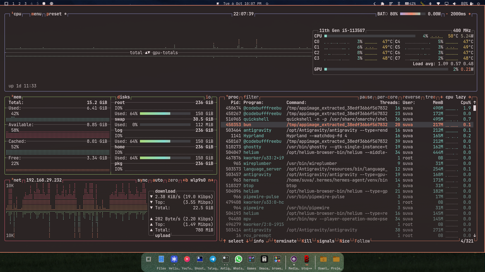
</p>

<p align="center">
  <a href="#-quick-start"><b>Quick Start</b></a> •
  <a href="#-core-features"><b>Features</b></a> •
  <a href="#-minimized-preview-tiles"><b>Preview Tiles</b></a> •
  <a href="#-customization--theming"><b>Theming</b></a> •
  <a href="#%EF%B8%8F-controls-cheat-sheet"><b>Controls</b></a> •
  <a href="#%EF%B8%8F-configuration-reference"><b>Configuration</b></a> •
  <a href="#-keyboard-shortcuts-via-ipc"><b>Keybindings</b></a> •
  <a href="#-faq"><b>FAQ</b></a> •
  <a href="https://github.com/sponsors/thepathless"><b>Sponsor ❤️</b></a>
</p>

</div>

---

## ❤️ Support the project

Omadock is built by one person — **suva ([@thepathless](https://github.com/thepathless))**, a medical student in India who codes between classes and clinics. It's free, and it always will be — but building it costs money I don't quite have: monthly AI coding tokens, and a laptop that's falling apart (dead WiFi, sticky keys, a trackpad with a mind of its own) — so I'm saving for a **[Dell XPS 13 (2026)](https://www.dell.com/en-us/blog/year-of-the-linux-laptop-omarchy-on-xps/)**.

If Omadock earns a place on your desktop, [**sponsoring me**](https://github.com/sponsors/thepathless) keeps the AI lights on and the laptop fund growing. Every supporter is honored on the [**supporters wall**](SPONSORS.md) 💝 — with love, no tiers, no perks.

### 💻 Laptop fund

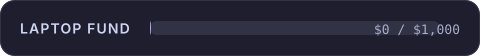

### 📊 Where donations went

| Month | AI tokens | Laptop fund | Notes |
| :--- | :--- | :--- | :--- |
| — | — | — | Just launched — be the first! 🙏 |

*(running total so far: **−₹499** for my coding-agent subscription — borrowed from my mom 😅. Updated monthly; honesty is the least I can offer)*

To everyone who donates — really, truly, thank you. 🙏

---

## ⚡ Overview

**Omadock (オマドック)** is a fluid, zero-CPU application dock for **[Omarchy](https://omarchy.org/)** — Arch, Hyprland, Quickshell.

Crafted in the spirit of **Omakase (おまかせ)**: wave magnification, live window previews, app groups, multi-monitor docks. Beautiful, opinionated, and strictly **0.00% background CPU**.

<p align="center">
  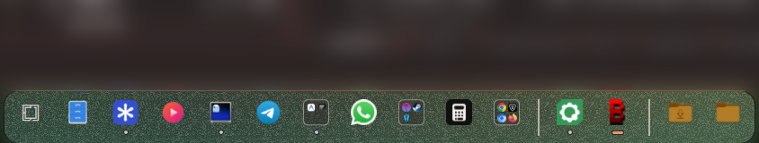
</p>

### ✨ Key Highlights

- **🌊 Wave magnification** — cosine-falloff dock physics, or classic zoom. Zero coordinate jumping.
- **🪟 Live window previews** — minimized windows park on the dock as thumbnail cards.
- **🔘 3-state window dots** — active, visible, and minimized at a glance.
- **📁 Folders & groups** — folder stacks with recent files, smart app collections, drag-to-group.
- **🖥️ Multi-monitor** — one dock per monitor, each showing its own monitor's windows.
- **💾 Removable media** — USB drives dock themselves; safe eject included.
- **🔔 Attention glow & chimes** — bouncing alerts and audio pings.
- **⌨️ Keybindings & IPC** — wired for `~/.config/hypr/bindings.lua` out of the box.

---

## 🚀 Quick Start

### Install

```bash
omarchy plugin add https://github.com/thepathless/omadock.git --enable --yes
```

### Update

```bash
omarchy plugin update omadock --yes
```

### Removal / Uninstall

```bash
omarchy plugin remove omadock --yes
```

---

## 🌟 Core Features

### 🔘 1. 3-State Window Indicators

Every icon shows all its windows at a glance: **▬** active · **●** open · **○** minimized.

| Window Count | Indicator Visual | Behavior |
| :--- | :--- | :--- |
| **1–4 windows** | `[ ▬ ] [ ● ] [ ○ ] [ ● ]` | Dedicated indicator dot/bar for every individual window. |
| **5 windows** | `[ ▬ ] [ ● ] [ ● ] [ ● ] [ ● ]` | Micro-dot scaling ($4\text{px}$) fits up to 5 instances cleanly. |
| **6+ windows** | `[ ▬ ] [ ● ] [ ● ] [ ● ] [ +N ]` | First 4 instance dots plus a compact `+N` count badge. |

---

### 🪟 2. Minimized Preview Tiles

When a window is parked on `special:minimized`, Omadock generates a live visual preview tile between your pinned and running applications:

<div align="center">
  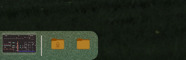
</div>

- **📸→🖱️** Thumbnails appear on minimize; **left-click restores** to the active workspace.
- **📍** Right-click a tile: *Restore Here*, *Restore to Original Workspace*, or *Close*.
- **📦** In `"all"` mode, same-app windows stack into one card with a count badge.
- **🧩** Unpinned apps collapse into their tile — the dock stays uncluttered.

---

### 🔄 3. Minimize on Click Modes

Configure how clicking a focused app icon behaves (`omadock.json` or the Settings menu):

1. **`"active"` (Default)**: Minimizes the active window and passes focus to the next instance.
2. **`"all"` (Group Batch)**: Simultaneously minimizes all instances of the application in an atomic batch.
3. **`"off"` (Disabled)**: Keeps all windows visible and cycles focus between open instances.

---

### 🌊 4. Wave & Zoom Magnification

Juan Pablo Zamora's raised-cosine falloff, in three modes:

$$\text{scale}(d) = 1 + (\text{peak} - 1) \cdot \frac{1 + \cos\left(\frac{\pi \cdot d}{R}\right)}{2} \quad \text{for } d \le R$$

- **`"wave"`** — the dock ripples under the cursor; zero feedback drift.
- **`"zoom"`** — only the hovered icon grows.
- **`"off"`** — calm, static geometry.

---

### 📁 5. Pinned Folder Stacks & File Popovers

Pin directories like `~/Downloads`, `~/Projects`, or custom paths directly to your dock:

- **Files popover** — up to 300 entries with icons, sizes, and relative times.
- **View As** — right-click the folder: *Stack* (a list) or *Folder* (a grid of larger icons, with previews for images and for anything your file manager has already thumbnailed), saved per folder.
- **Browse** — click a subfolder to step into it, **‹** to go back; long folders scroll.
- **Sort By** — right-click the folder: Name, Kind, Date Modified, Date Added or Size, saved per folder.
- **Direct opening** — click any file to open it in its default app (`xdg-open`), or jump to its folder.
- **Drag out** — drag a file from the popover into a file manager, browser or chat app.
- **Drop in** — drop a folder from your file manager onto the dock to pin it.
- **Folder picker** — attach custom folders from Settings through the desktop's file chooser (`omarchy-file-select` / XDG portal).

---

### 📁 6. App Group Folders (Smart Collections)

Organize applications into intelligent macOS / iOS-style folders directly on your dock:

- **2×2 live preview grid** with window dots; the popover tray scales 2–4 columns.
- **Drag-to-group, drag-to-pin** — drop one icon on another to make a folder.
- **Inline renaming**, saved instantly.
- **Drag-out extraction** — folders auto-dissolve when one app remains.

---

### 💾 7. Removable Media Auto-Docking

Zero-CPU hardware integration for removable media and USB storage:

- **udev + udisks2** detection of USB drives, SD cards, and external storage.
- **Tooltips** with capacity, label, and mount status; safe eject/unmount with notifications.

---

### 📐 8. Dock Alignment Options

Flexible screen placement tailored to your workflow:

- **`"center"`, `"left"`, `"right"`** along the bottom edge, with smooth cubic transitions.
- **Popovers, tooltips, and menus** self-reposition so nothing clips at screen edges.

#### 🖥️ Multi-Monitor Docks

Enable **Settings → Placement & Alignment → Show on All Monitors** (or `"multiMonitor": true`) to run a dock on every connected monitor:

- **Per-monitor apps** — each dock lists its own monitor's windows (pinned apps everywhere); `"perMonitorApps": false` mirrors everything.
- **Minimized tiles follow their origin** monitor, whichever dock parked them.
- **Hotplug aware**; keybinds act on the focused monitor first.

---

### ⚡ 9. FreeDesktop Jump Lists & Zero-CPU Autohide

Deep Linux desktop and compositor integration:

- **FreeDesktop jump lists** — native quick actions straight from `.desktop` files.
- **Intelligent autohide** — 2D AABB overlap tests on Hyprland events only. **0.00% CPU**, always.

---

## 🎨 Customization & Theming

Right-click the Omarchy logo or empty dock space to access deep customization.

### 🎛️ Settings Panel

Right-clicking either one opens the full settings panel directly: a sidebar with *Appearance*, *Placement*, *Behavior*, *Effects*, *Size & Spacing*, *Folders* and *App Groups*, with switches, sliders and dropdowns for every option. Changes apply live, so the dock underneath previews them. Close it with <kbd>Esc</kbd>, the close button, or a click outside. The panel can also be opened from a keybind: `omarchy-shell omadock openSettings`.

The settings at a glance:

<div align="center">
  <table>
    <tr>
      <th align="center" width="25%">Settings Menu</th>
      <th align="center" width="25%">Appearance</th>
      <th align="center" width="25%">Placement & Alignment</th>
      <th align="center" width="25%">Behavior & Windows</th>
    </tr>
    <tr>
      <td align="center" valign="top">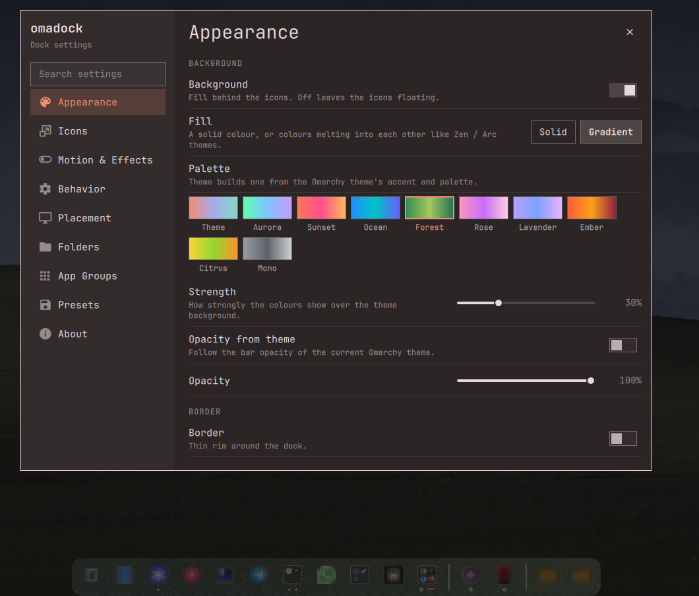</td>
      <td align="center" valign="top">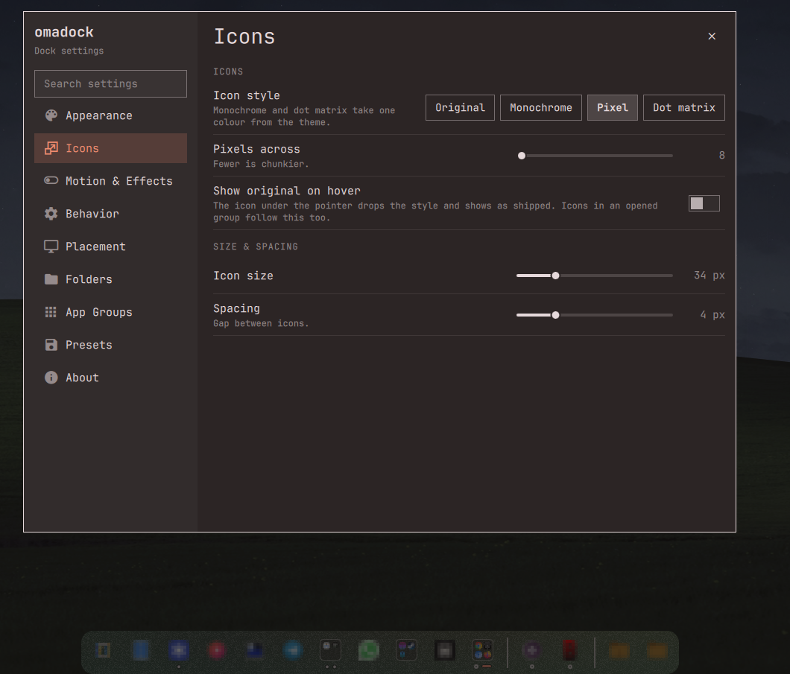</td>
      <td align="center" valign="top">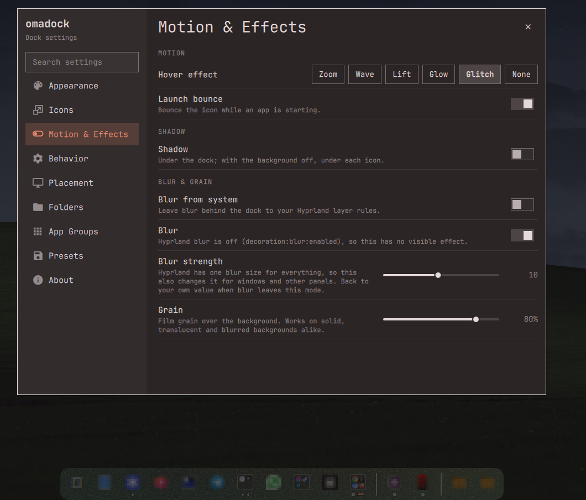</td>
      <td align="center" valign="top">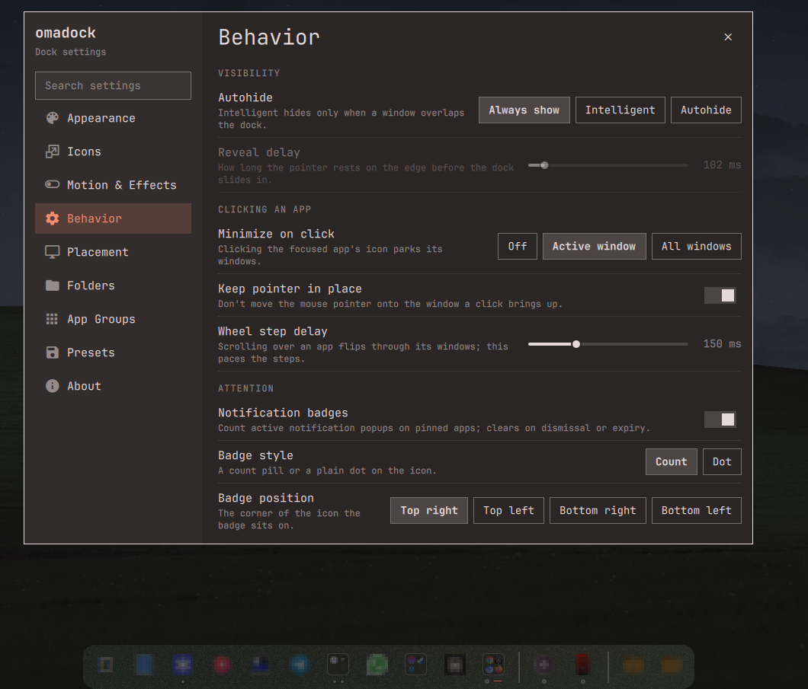</td>
    </tr>
    <tr>
      <th align="center" width="25%">Effects & Animations</th>
      <th align="center" width="25%">Size & Spacing</th>
      <th align="center" width="25%">Folders & Stacks</th>
      <th align="center" width="25%">App Folders & Groups</th>
    </tr>
    <tr>
      <td align="center" valign="top">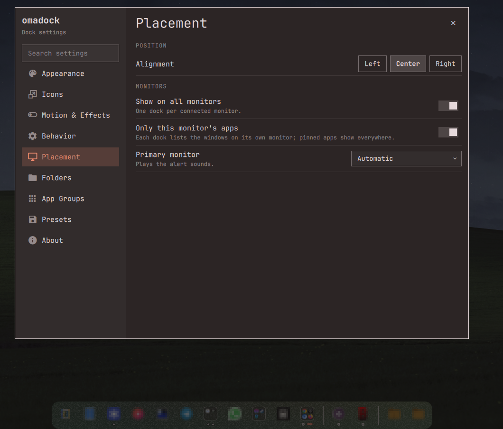</td>
      <td align="center" valign="top">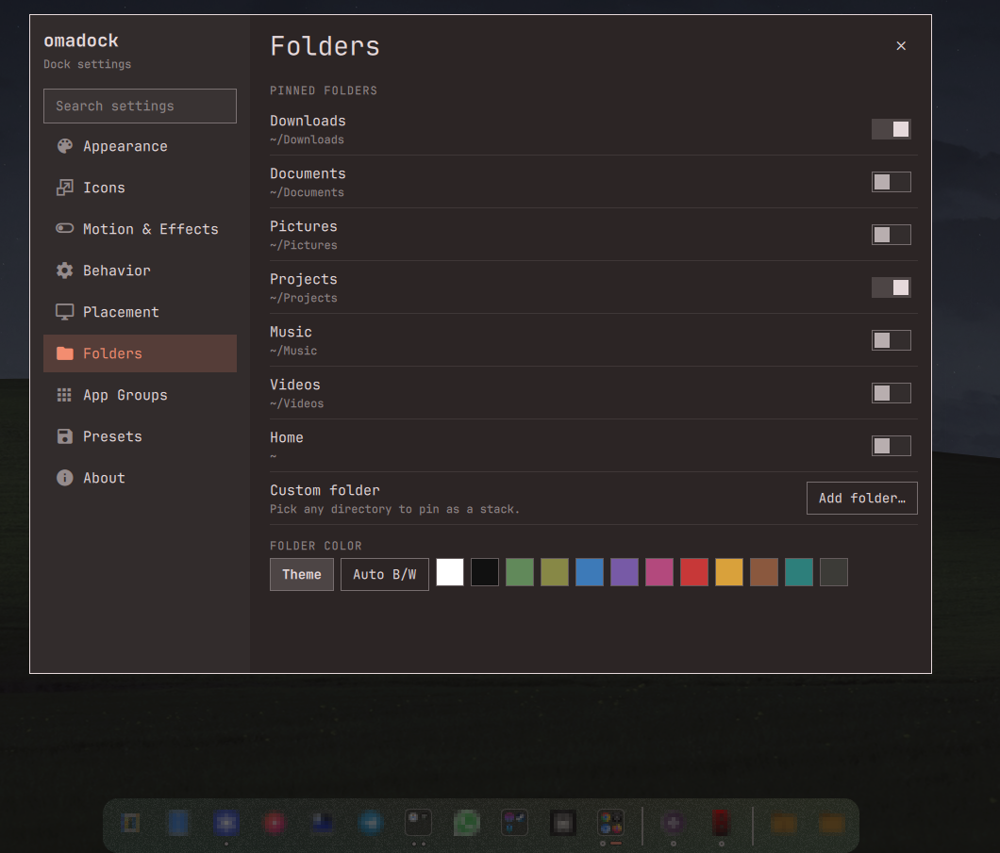</td>
      <td align="center" valign="top">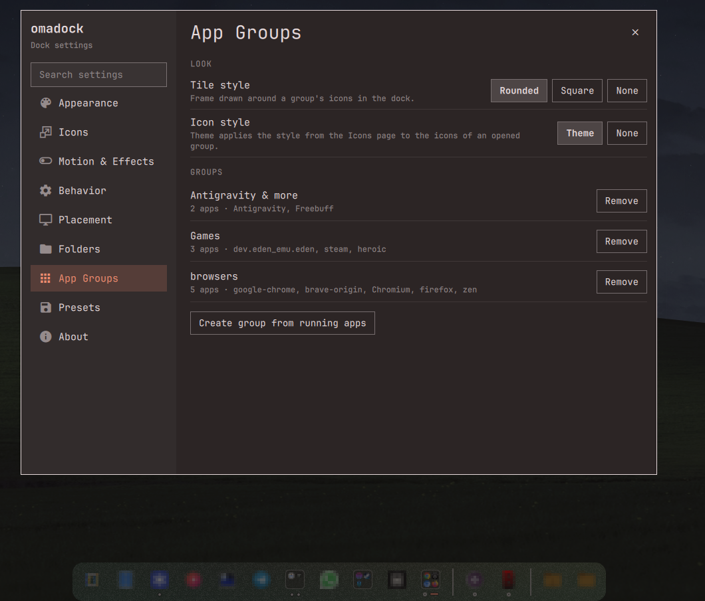</td>
      <td align="center" valign="top">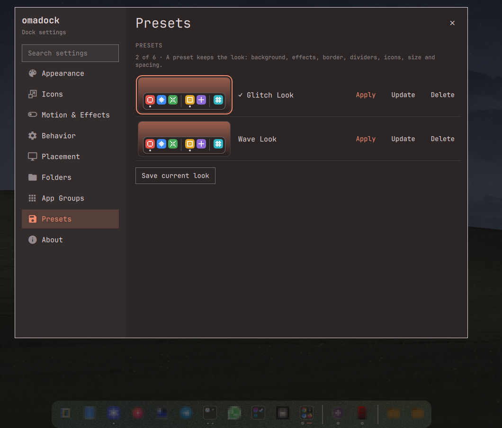</td>
    </tr>
  </table>
</div>

- **Shapes**: `Auto (Theme)`, `Rounded`, `Round (Pill)`, `Square`.
- **Opacity**: `Auto (Theme)`, `100%`, `80%`, `65%`, `35%`, `0% (Transparent Specular)`.
- **Placement & Alignment**: `Center (Default)`, `Left Aligned`, `Right Aligned` along the screen edge.
- **Color Presets**: Theme Auto, Pure Black, Mocha, Deep Slate, Midnight Blue, Dark Navy, Emerald Forest, Velvet Ruby.
- **Icon Sizing**: Small ($28\text{px}$), Medium ($36\text{px}$), Large ($44\text{px}$), Extra Large ($52\text{px}$).
- **App Folders & Groups**: Automatic smart collections from running apps, drag-to-group, in-place title renaming, and column scaling.

---

## 🖱️ Controls Cheat Sheet

| Gesture / Trigger | Target | Action Executed |
| :--- | :--- | :--- |
| **Left Click** | ❖ Omarchy Logo | Opens Omarchy Application Launcher |
| **Right Click** | ❖ Omarchy Logo | Opens Omadock Preferences Menu |
| **Scroll Wheel** | ❖ Omarchy Logo | Cycles active Hyprland workspaces |
| **Middle Click** | ❖ Omarchy Logo | Spawns default terminal emulator |
| **Left Click** | Application Icon | Launches app / focuses / restores window |
| **Middle Click** | Application Icon | Launches a **new instance** of the application |
| **Scroll Wheel** | Application Icon | Cycles focus through open instances |
| **Right Click** | Application Icon | Context menu (Window list, Desktop Actions, Pin, Close) |
| **Left Click** | Folder Stack | Toggles recent-files popover |
| **Right Click** | Folder Stack | Folder options (Open in File Manager, Unpin) |
| **Left Click** | Preview Tile | Restores window to current workspace |
| **Right Click** | Preview Tile | Restore Here / Restore to Original / Close |
| **Drag & Drop** | Pinned Icon | Reorders pinned application position live |
| **Drag & Drop** | Running App | Drag into pinned section to pin live |
| **Drag & Drop** | Dock App Icon | Drag onto another pinned app to create a folder |
| **Left Click** | App Group Folder | Toggles folder popover tray |
| **Right Click** | App Group Folder | Context menu (Rename, Ungroup, Set Columns) |
| **Drag & Drop** | App in Folder | Drag out onto dock to extract / unpin |
| **Left Click** | Removable Drive | Opens drive mountpoint in default file manager |
| **Right Click** | Removable Drive | Context menu to safely eject and unmount |
| **Bottom Edge Hover** | Screen Edge | Reveals autohidden dock instantly |

---

## ⚙️ Configuration Reference

Settings persist in `~/.config/omarchy/omadock.json` and are editable live:

<details open>
<summary><b>View Annotated Configuration Schema</b></summary>
<br />

```json
{
  "alignment": "center",
  "autohide": true,
  "intelligentAutohide": true,
  "showRemovableDrives": true,
  "minimizeMode": "active",
  "showMinimizedTiles": true,
  "opacity": 1.0,
  "shape": "rounded",
  "bgColor": "theme",
  "showBackground": true,
  "showShadow": true,
  "showBorder": true,
  "borderOpacity": "theme",
  "groupStyle": "rounded",
  "itemSpacing": 4,
  "iconSize": 0,
  "hoverEffect": "zoom",
  "showAppsButton": true,
  "showTooltips": true,
  "advancedTooltips": true,
  "launchBounce": true,
  "showUrgentHint": true,
  "urgentOnNotification": true,
  "urgentSound": true,
  "urgentSoundName": "bell",
  "folderColor": "theme",
  "revealDelay": 160,
  "tooltipDelay": 450,
  "pinnedFolders": [
    { "path": "~/Downloads", "name": "Downloads", "icon": "folder-download" }
  ],
  "appGroups": [
    { "id": "browsers", "name": "browsers", "apps": ["google-chrome", "brave-browser", "chromium", "firefox", "zen-browser"] }
  ]
}
```

</details>

<br />

| Key | Type | Default | Description |
| :--- | :--- | :--- | :--- |
| `alignment` | `string` | `"center"` | Dock placement along screen edge: `"center"`, `"left"`, `"right"`. |
| `screen` | `string` | first monitor | Monitor for the single dock (e.g. `"DP-3"`). With `multiMonitor`, the dock on this monitor plays alert sounds. |
| `multiMonitor` | `bool` | `false` | Runs one dock on every connected monitor. |
| `perMonitorApps` | `bool` | `true` | With `multiMonitor`, each dock lists only the windows on its own monitor. |
| `autohide` | `bool` | `true` | Enables dock autohiding on hover exit. |
| `intelligentAutohide` | `bool` | `true` | Hides dock only when windows overlap its bounding box (AABB). |
| `showRemovableDrives` | `bool` | `true` | Auto-detect and display removable USB thumb drives and storage. |
| `appGroups` | `array` | `[]` | App Folders / Groups configuration (name, custom icon, app ID list). |
| `groupStyle` | `string` | `"rounded"` | Group tile frame: `"rounded"` (softly rounded rim), `"square"` (rim without rounding) or `"none"` (icons only). |
| `groupIconEffects` | `string` | `"theme"` | Icons inside group tiles: `"theme"` follows `iconStyle`, `"none"` keeps them original. |
| `minimizeMode` | `string` | `"active"` | `"active"` (FIFO single), `"all"` (batch group), `"off"` (disabled). |
| `showMinimizedTiles` | `bool` | `true` | Displays live screencopy preview tiles for parked windows. |
| `opacity` | `number \| str` | `1.0` | Background opacity: `"theme"`, `1.0`, `0.80`, `0.65`, `0.35`, `0.0`. |
| `shape` | `string` | `"rounded"` | Dock geometry: `"rounded"`, `"round"` (pill), `"square"`, `"theme"`. |
| `bgColor` | `string` | `"theme"` | `"theme"`, `"none"`, or custom hex string (`"#1e1e2e"`). |
| `showBackground` | `bool` | `true` | Draws the dock's background fill. `false` leaves the icons floating. |
| `showShadow` | `bool` | `true` | Draws the soft drop shadow under the dock. |
| `showBorder` | `bool` | `true` | Draws the rim around the dock. |
| `borderWidth` | `number` | `1.5` | Rim width in pixels, `1`–`6`. |
| `shadowStrength` | `number` | `0.4` | Shadow opacity, `0.0`–`1.0`. |
| `blur` | `string` | `"system"` | Blur behind the dock: `"system"` (your Hyprland layer rules decide), `"on"` or `"off"` (a runtime layer rule overrides them). The strength is Hyprland's global `decoration:blur` size. |
| `iconStyle` | `string` | `"original"` | `"original"`, `"mono"` (one theme colour, shading kept), `"pixel"` (coarse grid, unsmoothed) or `"dots"` (dithered dot matrix). |
| `iconTint` | `string` | `"text"` | Colour for `mono` and `dots`: the dock's `"text"` colour or the theme `"accent"`. |
| `iconGrid` | `int` | `16` | Pixels / dots across an icon for `pixel` and `dots` (`8`–`32`). |
| `folderColor` | `string` | `"theme"` | `"theme"`, `"symbolic"`, `"white"`, `"black"`, `"Yaru-blue"`, etc. |
| `hoverEffect` | `string` | `"zoom"` | Hover growth mode: `"zoom"`, `"wave"`, or `"off"`. |
| `revealDelay` | `int` | `160` | Edge dwell time in milliseconds before unhiding ($0$–$2000$). |
| `tooltipDelay` | `int` | `450` | Tooltip hover dwell delay in milliseconds ($0$–$5000$). |

---

## ⌨️ Keyboard Shortcuts via IPC

Omadock registers IPC commands callable directly by Quickshell.

### Automated Setup (Recommended)
Run the bundled keybinding helper script to automatically configure all shortcuts:
```bash
~/.config/omarchy/plugins/omadock/bind-keys.sh
```

### Manual Setup
Add these keybinds to `~/.config/hypr/bindings.lua`:

```lua
-- Toggle Dock Visibility
o.bind("SUPER + D", "Toggle Omadock", "exec qs -p /usr/share/omarchy/shell ipc call omadock toggleVisibility")

-- Minimize currently focused window to Omadock
o.bind("SUPER + M", "Minimize focused window", "exec qs -p /usr/share/omarchy/shell ipc call omadock minimizeActive")

-- Restore longest-parked window (FIFO)
hl.unbind("SUPER + SHIFT + M")
o.bind("SUPER + SHIFT + M", "Restore oldest minimized", "exec qs -p /usr/share/omarchy/shell ipc call omadock restoreLast")
```

Additional IPC methods available:
- `reveal`: Force dock to slide into view.
- `hide`: Force dock to slide out of view.
- `setAlignment("center" | "left" | "right")`: Change dock alignment dynamically.
- `setPosition("bottom" | "top" | "left" | "right")`: Change dock edge position.
- `openSettings`: Open the settings panel on the focused monitor's dock.
- `openSettingsPage("appearance" | "placement" | "behavior" | "effects" | "size" | "folders" | "groups")`: Open the settings panel on a given page.
- `closeSettings`: Close the settings panel.

> [!NOTE]
> The `-p /usr/share/omarchy/shell` flag is mandatory to target the active Omarchy system shell instance.

---

## ❓ FAQ

<details>
<summary><b>Where are minimized windows stored?</b></summary>
<br />
Windows are placed onto Hyprland's hidden <code>special:minimized</code> workspace. Omadock remembers their origin workspace so you can restore them instantly to where they belong.
</details>

<details>
<summary><b>How do I pin or unpin applications?</b></summary>
<br />
Right-click any running application icon and click <b>Pin to Dock</b>. Pinned applications are stored in <code>~/.config/omarchy/dock.json</code>. You can drag and drop icons along the dock to reorder them live.
</details>

<details>
<summary><b>How do I make the dock completely transparent?</b></summary>
<br />
Right-click the Omarchy logo → <b>Appearance</b> → <b>Background Opacity</b> → <b>Transparent (0%)</b>. The dock renders a clean specular border around the active icons.
</details>

<details>
<summary><b>How do I reload after manual JSON edits?</b></summary>
<br />
Run <code>omarchy restart shell</code> in your terminal to instantly reload the Quickshell engine.
</details>

---

## 🛠️ Diagnostics & Validation

```bash
# Validate manifest compliance against Omarchy 4.0.1+ standards
omarchy plugin validate ~/Projects/omadock

# Inspect live compositor journal logs
journalctl --user -xeu omarchy-shell -n 50 --no-pager

# Smoke test IPC integration
qs -p /usr/share/omarchy/shell ipc call omadock minimizeActive
qs -p /usr/share/omarchy/shell ipc call omadock restoreLast
```

---

## 📄 License

Distributed under the **MIT License**.  
Copyright © 2026 **[thepathless](https://github.com/thepathless)**.

---

## 📋 Version Changes & Bug Fixes

A running changelog of user-facing changes. Full detail lives in the [commit history](https://github.com/thepathless/omadock/commits/main).

### v3.8.0 — 2026-09-28
- **Feature ([#11](https://github.com/thepathless/omadock/pull/11), contributed by [@G-Pappas](https://github.com/G-Pappas)):** opt-in **multi-monitor mode** — one dock per connected monitor, each listing only the windows on that monitor (like the Windows taskbar on every display). Pinned apps appear on every dock, minimized tiles follow their origin monitor, monitors are hotplug-aware, and keybinds act on the focused monitor's dock first. Enable via *Settings → Placement & Alignment → Show on All Monitors* or `"multiMonitor": true`. **Off by default** — single-dock behavior is unchanged.

### v3.7.3 — 2026-09-28
- **Bug Fix ([#9](https://github.com/thepathless/omadock/issues/9)):** the dock no longer vanishes after suspend/resume. When outputs go away (sleep, monitor unplug, DPMS) Hyprland closes every layer surface and Quickshell deletes the dock window — the dock now detects that and rebuilds its surface as soon as a real screen returns.
- **Bug Fix:** launching an app that is no longer installed now shows an **“App no longer installed”** notification instead of failing silently — stale pinned icons no longer bounce on click.
- **Improvement:** *Pin to Dock* validates the desktop id first and refuses ids that no longer resolve to an installed app, with the same clear notification.
- **Tooling:** the launch-id validation harness (`tests/launch-harness.py`) is now part of the repository's verification suite — it checks every installed desktop-entry id against the dock's `gtk-launch` suffix logic (Desktop Entry Spec + GIO ground truths).

### v3.7.2 — 2026-09-25
- **Bug Fix:** desktop ids that themselves end in `.desktop` (e.g. `org.telegram.desktop`) failed to launch — the `.desktop` suffix is now always appended for `gtk-launch`.

### v3.7.1 — 2026-09-23
- **Security (marketplace review):** watched config reads are byte-capped, persisted collections (app groups, pinned folders) are shape/size-bounded, and reload cycles are debounced.

### v3.7.0 — 2026-09-22
- **Feature:** expanded dock hitbox, smoother autohide slide curves, and increased hide hysteresis.
- **Feature:** absolute-path icon index — dock icons survive broken or missing icon themes (e.g. `vantablack` → `Yaru-gray`).
- **Feature:** theme accent color (`Color.accent`) replaces the never-defined `Color.bar.active` fallback across all 41 touchpoints.

### v3.6.x highlights
- **v3.6.5:** monochrome (`white`/`black`/`symbolic`) folder icons preserved through icon resolution.
- **v3.6.4 / v3.6.3:** explicit Yaru folder-color paths kept; `noDisplay` desktop entries hidden from the dock.
- **v3.6.0:** stable baseline — zero-CPU region autohide, tiling window adaptation, app groups, folders, minimized-window tiles.
